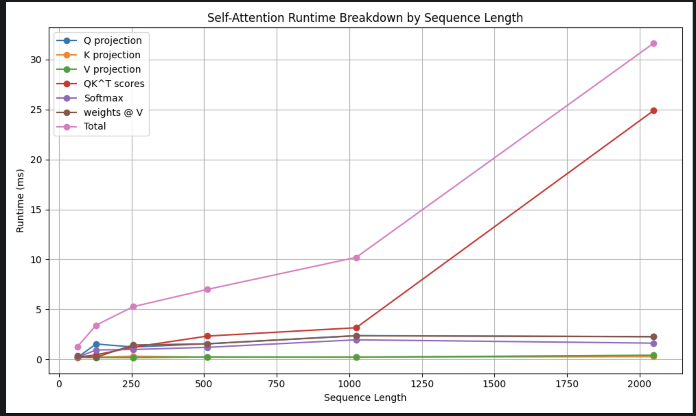

# Transformer Self-Attention Runtime Benchmarking  
  

## Description of Key, Query, Value Vectors  
Query: Represents the current token in a sentence the model focuses on, or tries to understand.  
The query is used to probe the other parts of the input sentence to determine how much attention to pay to them.
Key: Each token has an associated key. These keys are used to match the query.
Value: Encodes actual content or representation of a token. Once the model determines which keys are most relevant 
to the query, it retrieves the corresponding values.  

E.g. sequence: "The cat sat down"  
d=4, where d is the token embedding dimension  

Let X be the input embedding matrix:  
Token, d0, d1, d2, d3  
=======================  
The, 1.0, 0.2, 0.1, 0.5  
cat, 0.3, 1.2, 0.7, 0.1  
sat, 0.5, 0.4, 1.1, 0.9  
down, 0.8, 0.6, 0.2, 1.0  

X ∈ R^4×4  
4 tokens x 4 dimensions  

### What "Q Projection" means  
Q = X @ Wq  => Q = X Wq  
Wq ∈ R^4×4  

Note: Wq is a learned Query projection matrix.  
So, (4x4)(4x4) = 4x4  

The output Q has one query vector per token.  
e.g. 
Wq = [0.1 0.2 0.0 0.3  
      0.0 0.1 0.4 0.2  
      0.3 0.0 0.2 0.1  
      0.2 0.3 0.1 0.0]  

Compute query for "The":  
X_The = [1.0, 0.2, 0.1, 0.5]  
Q_The = X_The * Wq  
(1x4) (4x4) = (1x4)  

Q_The = [0.23, 0.37, 0.15, 0.35]  

Q projection = token_embeddings -> query_projection_matrix -> query_vectors
Same idea applies to K and V projections.  

K = X @ Wk  
V = X @ Wv  

Note: Wq is the same across ALL tokens. This is a fundamental property of Transformers.  The same Wq matrix is applied  
to every token in the sequence.  

### Analogy  
Imagine "The", "cat", "sat", "down" are 4 photographs.  And Wq is a camera filter.  You don't apply a new filter to every picture. You apply 
the same filter to every picture.  The input differs so the output differs.  

So mathematically, we compute:  
`The x Wq`, `cat x Wq`, `sat x Wq`, `down x Wq` using one shared learned matrix.  Weight sharing is one of the key ideas behind transformers.  

## The Big Picture  
For one transformer layer, there are three learned projection matrices:  
* Wq -> creates Queries  
* Wk -> creates Keys  
* Wv -> creates Values  

They are shared across every token in the sequence. This is why PyTorch code can compute:  
Q = X @ Wq in one matrix multiplication  
It is simultaneously applying the same Wq to every row of X, producing one query vector per token.  

This is exactly why matrix multiplication is so efficient on GPUs. 
Instead of looping:  
`for token in tokens: q = token @ Wq`  
PyTorch performs one large batched operation `Q = X @ Wq`  
GPUs can execute this extremely efficiently using highly optimized linear algebra kernels.  