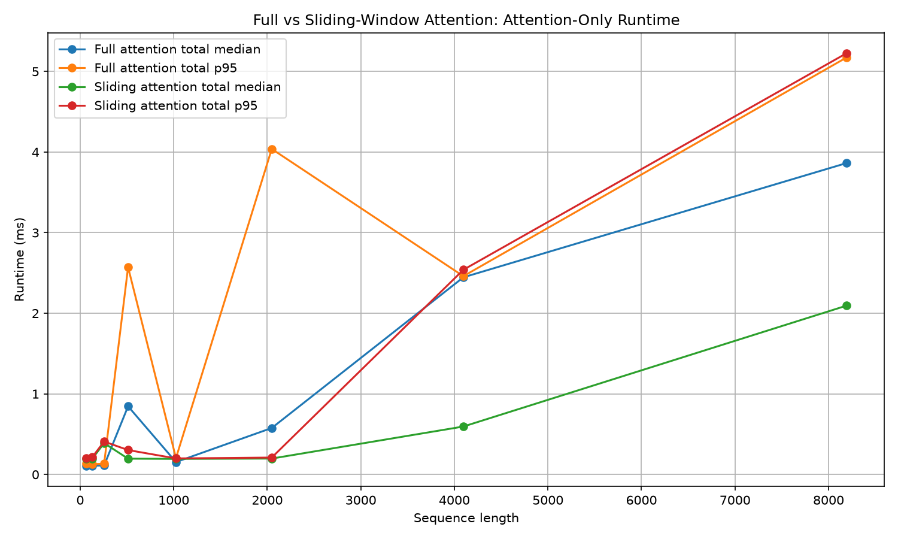
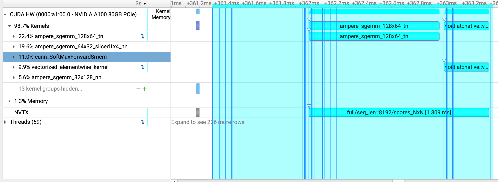
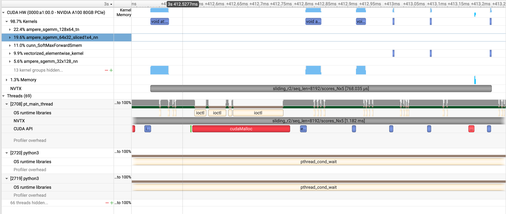

# Benchmark Analysis  
## FULL VS SLIDING COMPARISON MATRIX  
####################################  
FULL VS SLIDING COMPARISON  
####################################    
       N |  full attn ms |  slide attn ms |  attn speedup |   full entries |  slide entries | entry ratio | full score MB | slide score MB  
------------------------------------------------------------------------------------------------------------------------------------------  
      64 |         0.109 |          0.196 |          0.55 |          4,096 |            314 |       13.04 |          0.02 |         0.0012  
     128 |         0.107 |          0.194 |          0.55 |         16,384 |            634 |       25.84 |          0.06 |         0.0024  
     256 |         0.112 |          0.389 |          0.29 |         65,536 |          1,274 |       51.44 |          0.25 |         0.0049  
     512 |         0.846 |          0.196 |          4.31 |        262,144 |          2,554 |      102.64 |          1.00 |         0.0098  
    1024 |         0.154 |          0.193 |          0.80 |      1,048,576 |          5,114 |      205.04 |          4.00 |         0.0195  
    2048 |         0.577 |          0.197 |          2.92 |      4,194,304 |         10,234 |      409.84 |         16.00 |         0.0391  
    4096 |         2.446 |          0.595 |          4.11 |     16,777,216 |         20,474 |      819.44 |         64.00 |         0.0781  
    8192 |         3.863 |          2.094 |          1.84 |     67,108,864 |         40,954 |     1638.64 |        256.00 |         0.1562  
####################################   

### 1. The score-entry math is exactly correct  
We ran with:  
`window_radius = 2`  

So sliding attention attends to at most:  
`2 left + self + 2 right = 5 tokens`  

The sliding score-entry formula is:  
`5N - 6`  

The -6 comes from edge tokens that do not have two neighbors on both sides.  
`For N = 8192: 5N - 6 = 5 * 8192 - 6 = 40954`  
So the sliding-window logic is working correctly.  

Full attention is: `N²`  
For 8192: `8192² = 67,108,864`  

### 2. The algorithmic reduction is huge  
At N=8192:  
`full entries = 67,108,864`  
`sliding entries = 40,954`  
`entry ratio = 1638.64x`  

That means full attention computes about 1,639x more attention score entries than sliding-window attention.  

This is the cleanest proof of the lab:  
`Full attention = O(N²)`  
`Sliding attention = O(N × window)`  

Since your window radius is fixed at 2, local width is fixed at 5, so sliding becomes effectively: `O(N)`  

### 3. Memory result is also excellent  
At N=8192:  
`full score MB  = 256.00 MB`  
`slide score MB = 0.1562 MB`  
That is also a ~1639x reduction, matching the entry ratio.  

This is the most important practical benefit of sliding attention. Even if runtime is noisy, the score tensor memory reduction is undeniable.  

### 4. Runtime is directionally useful, but not proportional to math work  
The runtime speedup is not 1639x. At 8192, it is only:  
`3.863 ms / 2.094 ms = 1.84x`  
That is not a bug. It tells us something important about implementation and hardware.  

Full attention uses:  
`Q @ K.T`  
`weights @ V`
Those are dense matrix multiplications. On an A100, dense GEMMs are extremely optimized and can use Tensor Cores / highly tuned cuBLAS kernels.  

Your sliding implementation avoids the N x N matrix, but it uses gather/indexing operations like:  
`K_windows = K[safe_indices]`  
`V_windows = V[safe_indices]`  

Then elementwise multiply and reduce:  
`(Q.unsqueeze(1) * K_windows).sum(dim=-1)`  

That is mathematically cheaper, but not necessarily as hardware-efficient as a large dense GEMM.  
So this lab demonstrates the algorithmic win, but not yet the full production-kernel speedup you would expect from a fused sliding-window attention kernel.  

### 5. Small-N runtime is not meaningful  
For small sequence lengths, sliding is sometimes slower:  
`N=64   full 0.109 ms, sliding 0.196 ms`  
`N=128  full 0.107 ms, sliding 0.194 ms`  
`N=256  full 0.112 ms, sliding 0.389 ms`  

That is expected. At small N, fixed overhead dominates:  
`kernel launches`  
`index tensor handling`  
`gather overhead`
`PyTorch dispatch overhead`  
`synchronization noise`  

Full attention wins there because dense matmul is a very optimized path.  

The interesting region is larger N, where full attention’s N² memory and work start to show up:  
`N=4096  full 2.446 ms, sliding 0.595 ms  → 4.11x speedup`  
`N=8192  full 3.863 ms, sliding 2.094 ms  → 1.84x speedup`  

### 6. One oddity to investigate  
This row is suspicious:  
`N=512   full attn ms = 0.846`  
`N=1024  full attn ms = 0.154`  

A larger full-attention problem should not normally be much faster than a smaller one. This could be due to CUDA kernel selection, measurement noise,  
allocator behavior, or an outlier affecting the median. It is worth checking the full comparison_attention_only_runtime.png and possibly the p95 values in   
comparison_metrics.csv.  

### Current Conclusion  
The script confirms the expected complexity reduction. Full attention creates N² score entries, while sliding-window attention with radius 2 creates only 5N - 6  
valid score entries. At N=8192, this reduces score entries and score tensor memory by about 1639x. Runtime improves at larger sequence lengths, but the speedup is   
much smaller than the mathematical reduction because full attention uses highly optimized dense GEMM kernels, while this sliding implementation uses PyTorch   
gather/indexing operations rather than a fused sparse/local attention kernel.  

## SCORE ENTRIES COMPARISON CHART  
  

It shows exactly what we expected:  
`Full attention score entries = N²`  
`Sliding attention score entries  ≈ N × window_width`  

### What the log scale is showing  
The y-axis is logarithmic. That is useful here because full attention gets huge quickly.  

At N = 8192:  
`Full entries    = 67,108,864`  
`Sliding entries = 40,954`  

So full attention computes:  
`67,108,864 / 40,954 ≈ 1638.6x`  
more attention score entries.  

### Why the full line bends upward faster  
For full attention, every token attends to every token:  
`N tokens × N keys = N² score entries`  

So doubling N multiplies the score entries by roughly:  
`2² = 4x`  

For sliding-window attention with fixed window size:  
`N tokens × 5 local keys ≈ 5N score entries`
So doubling N multiplies score entries by roughly: 2x  

**That is the exact difference between quadratic and linear growth.**  

The score-entry count confirms the expected complexity reduction. Full attention creates an N × N attention matrix,  
so the number of score entries grows as O(N²). Sliding-window attention with radius 2 creates at most five score entries per token,   
so the total score entries grow as O(N × 5), effectively linear in N for fixed window size. At sequence length 8192, full attention   
computes 67.1M score entries while sliding-window attention computes only 40,954 entries, a reduction of approximately 1639x.  

## FULL VS. SLIDING WINDOW ATTENTION: ATTENTION-ONLY RUNTIME CHART  
  

### Median makes sense  
The median line is the reliable story here.
For larger N, full attention rises faster than sliding attention:  
`N=4096: full ≈ 2.45 ms, sliding ≈ 0.60 ms`  
`N=8192: full ≈ 3.86 ms, sliding ≈ 2.09 ms`  

That directionally matches the algorithmic expectation:  
`full attention     → N² score matrix`  
`sliding attention  → N × local_window score matrix`  

### P95 look suspicious/noisy  
The weird parts are especially:  
`full p95 spike around N=512`  
`full p95 spike around N=2048`  
`sliding p95 at N=8192 almost as high or higher than full p95` 
That does not map cleanly to the theoretical complexity story.  

### Why p95 is noisy here  
The main reason is that p95 with only 30 runs is fragile.

With 30 samples, the 95th percentile is basically very close to the slowest or second-slowest run. So one bad run caused by CUDA scheduling,  
allocator behavior, first-use kernel behavior, or background GPU/system noise can distort the p95 line.  

So the median is a better “steady-state” signal, while p95 is showing tail noise.  

Inspecting the `comparision_metrics.csv` p95 is mostly noise/outliers, and the CSV tells us exactly where the p95 weirdness comes from.  

|            Case | Median attention ms | P95 attention ms | Main p95 source         |  
| --------------: | ------------------: | ---------------: | ----------------------- |  
|     full, N=512 |               0.846 |            2.572 | `scores_p95 = 2.503 ms` |  
|    full, N=2048 |               0.577 |            4.038 | `scores_p95 = 3.871 ms` |  
| sliding, N=4096 |               0.595 |            2.539 | `scores_p95 = 2.442 ms` |  
| sliding, N=8192 |               2.094 |            5.225 | `scores_p95 = 5.078 ms` |  

Softmax is very stable:  
`full N=8192 softmax median 0.448 ms, p95 0.450 ms`  
`sliding N=8192 softmax median 0.026 ms, p95 0.027 ms`  

weights @ V is also stable:  
`full N=8192 output median 1.081 ms, p95 1.086 ms`  
`sliding N=8192 output median 0.120 ms, p95 0.122 ms`  

**QK score generation has tail spikes.**  

## Why full attention p95 is weird  
For full attention, the suspicious rows are:  
`N=512   scores median 0.776 ms, p95 2.503 ms`  
`N=2048  scores median 0.411 ms, p95 3.871 ms`  

That is not a smooth algorithmic curve. It looks like occasional slow GEMM/kernel/allocator behavior.  
The N=2048 full case also has projection p95 spikes:  
`q_proj median 0.224 ms, p95 1.694 ms`  
`v_proj median 0.211 ms, p95 1.671 ms`  

## Why sliding p95 is weird  
For sliding attention, the p95 tail at large N is also from scores:  
`N=4096  sliding scores median 0.497 ms, p95 2.442 ms`  
`N=8192  sliding scores median 1.946 ms, p95 5.078 ms`  

This makes sense implementation-wise. Sliding scores use indexed gather/materialization. 
`K_windows = K[safe_indices]`  
`scores = (Q.unsqueeze(1) * K_windows).sum(dim=-1)`  

That is not a nice dense GEMM. It is more memory-access irregular and less optimized than:  
`Q @ K.T`  

So the sliding implementation has much less math, but its score step is more vulnerable to implementation overhead and memory behavior.  

**The median results show the expected algorithmic benefit of sliding-window attention. The p95 results should not be interpreted as an algorithmic scaling result  
from this run. The p95 spikes are concentrated in the score-generation step, especially full Q @ K.T at some intermediate sizes and sliding-window indexed score  
generation at large sizes. Softmax and weights @ V are comparatively stable.**  

## NSYS Profiling Analysis  
  
**full/seq_len=8192/scores_NxN**  
Nsight shows the NVTX range duration: 1.309 ms  

That NVTX range corresponds to this code:  
`scores = (Q @ K.T) / math.sqrt(embed_dim)`  
For N=8192, that means:  
`Q shape      = [8192, 128]`  
`K.T shape    = [128, 8192]`  
`scores shape = [8192, 8192]`  

So full attention is producing:  
`8192 × 8192 = 67,108,864 score entries`  

### Most important observation  
Inside that scores_NxN range, the visible kernels are:  
`ampere_sgemm_128x64_tn`  
`ampere_sgemm_128x64_tn`  
That is exactly what we expected. sgemm means single-precision general matrix multiplication. So this confirms:  
**Full attention score computation is running as dense GEMM on the A100.**  

That is why full attention performs surprisingly well despite computing 67 million score entries. It maps to very optimized GPU matrix multiplication kernels.  

### Why this matters  
Algorithmic table said full attention has huge work:  
`full score entries = 67,108,864`
But Nsight now tells us that this huge work is handled by efficient GEMM kernels.  
So this explains the earlier mismatch:  
`Algorithmically expensive? yes`  
`Hardware-efficient? also yes`  

Full attention is expensive in N², but it is a very GPU-friendly operation.  

### Current conclusion from this screenshot  
For the full-attention score step:  
* Operation: Q @ K.T  
* Shape: [8192,128] × [128,8192]  
* Output: [8192,8192]  
* Score entries: 67.1M  
* Nsight kernel type: ampere_sgemm  
* Duration: ~1.309 ms  
Interpretation: large quadratic score matrix, but efficiently executed as dense GEMM   

  
**sliding/seq_len=8192/scores_NxN**  
This is the sliding-window score step.  

### Key comparison with full attention
For full attention, we saw:  
* full/seq_len=8192/scores_NxN  
* duration ≈ 1.309 ms  
* kernel type: ampere_sgemm_128x64_tn  

That means full attention score computation is mostly a clean dense GEMM:  
`scores = Q @ K.T`  

For sliding attention, this screenshot shows:  
* sliding_r2/seq_len=8192/scores_Nx5  
* GPU activity shown ≈ 768 µs  

But the important thing is: it is not one clean GEMM.  
`cudaMalloc inside the sliding scores range`  
`ioctl calls`  
`multiple smaller CUDA kernels`  
`vectorized/void kernels`  
`less clean GEMM structure`  

What this means  
Sliding attention mathematically computes far fewer score entries:  
`full     = 67,108,864 score entries`  
`sliding  = 40,954 score entries`  

But the sliding implementation does this:  
`K_windows = K[safe_indices]`
`scores = (Q.unsqueeze(1) * K_windows).sum(dim=-1)`  

That requires materializing/indexing temporary tensors. So instead of one optimized GEMM, PyTorch launches several smaller operations and allocates temporary memory.  
That is why the runtime speedup is much smaller than the score-entry reduction.  

**Lower asymptotic complexity does not automatically mean proportional wall-clock speedup unless the kernel implementation is also efficient.**  

# Is sliding window attention technique used in modern LLMs?  
Yes — sliding-window attention is used in modern LLMs, but usually as part of a hybrid attention design, not always as the only attention mechanism everywhere.  

The most relevant examples:  

## Mistral 7B  
Mistral 7B explicitly uses Sliding Window Attention, along with Grouped-Query Attention. The Mistral paper says it uses GQA for faster inference and SWA to handle longer sequences with reduced inference cost.  

Mistral’s own announcement explains the stacked-layer intuition nicely: token i at layer k attends only to tokens in its local window from the previous layer, but because previous-layer tokens themselves attended to earlier windows, higher layers can indirectly access information further back than a single window.  
That is important: sliding window does not mean the model is completely blind beyond the window. Information can propagate through layers.  

## Gemma 2  
Gemma 2 uses a hybrid local/global pattern. The Gemma 2 report says it alternates between local sliding-window attention and global attention layers. The local sliding-window size is 4096 tokens, while global attention spans 8192 tokens.  

So Gemma 2 is a great modern example of this idea:  
`some layers: local sliding-window attention`  
`some layers: global attention`  
That gives a tradeoff: lower cost from local attention, but still occasional full/global mixing.  

## Why modern LLMs use it  
The reason is exactly what our lab showed:  
`full attention score entries     = N²`  
`sliding attention score entries  ≈ N × window`  

For long context, full attention becomes expensive in both compute and memory. Sliding-window attention reduces the attention matrix from:  
[N, N] to [N, window_width]  

Our benchmark with radius 2 showed the same principle in miniature:  
`N=8192 full entries    = 67,108,864`  
`N=8192 sliding entries = 40,954`  
In real models, the window is much larger, such as thousands of tokens, but the scaling idea is the same.  

### But there is a tradeoff  
Pure sliding-window attention can weaken long-range retrieval, because a token cannot directly attend to every previous token. That is why many models combine it with one or more of these:  
* `global attention layers`  
* `attention sinks / special retained tokens`  
* `longer local windows`  
* `KV cache tricks / rolling buffers`  
* `RoPE scaling`  
* `FlashAttention-style kernels`  

So the correct mental model is:  
**Sliding-window attention is a real production technique, but modern LLMs usually use it carefully, often mixed with global attention or other mechanisms,  
because pure local attention improves efficiency but can hurt long-range recall.**  

