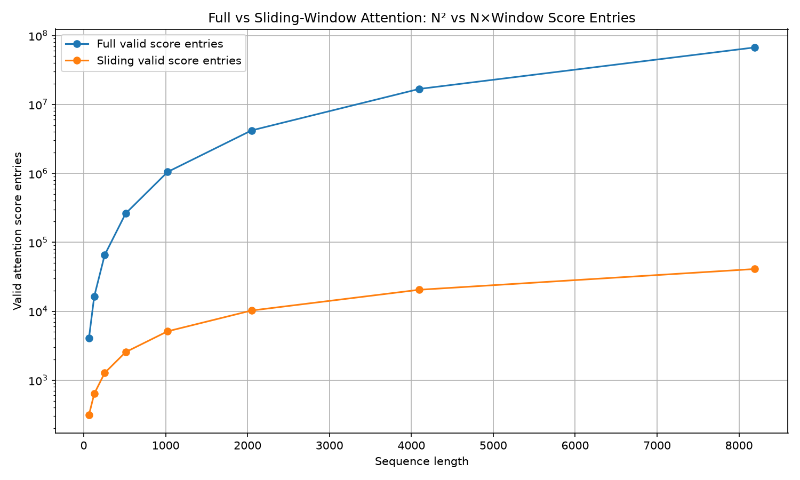

# Benchmark Analysis  
## FULL VS SLIDING COMPARISON MATRIX  
#########################################################################  
FULL VS SLIDING COMPARISON  
#########################################################################    
       N |  full attn ms |  slide attn ms |  attn speedup |   full entries |  slide entries | entry ratio | full score MB | slide score MB  
------------------------------------------------------------------------------------------------------------------------------------------  
      64 |         0.109 |          0.196 |          0.55 |          4,096 |            314 |       13.04 |          0.02 |         0.0012  
     128 |         0.107 |          0.194 |          0.55 |         16,384 |            634 |       25.84 |          0.06 |         0.0024  
     256 |         0.112 |          0.389 |          0.29 |         65,536 |          1,274 |       51.44 |          0.25 |         0.0049  
     512 |         0.846 |          0.196 |          4.31 |        262,144 |          2,554 |      102.64 |          1.00 |         0.0098  
    1024 |         0.154 |          0.193 |          0.80 |      1,048,576 |          5,114 |      205.04 |          4.00 |         0.0195  
    2048 |         0.577 |          0.197 |          2.92 |      4,194,304 |         10,234 |      409.84 |         16.00 |         0.0391  
    4096 |         2.446 |          0.595 |          4.11 |     16,777,216 |         20,474 |      819.44 |         64.00 |         0.0781  
    8192 |         3.863 |          2.094 |          1.84 |     67,108,864 |         40,954 |     1638.64 |        256.00 |         0.1562  
##########################################################################   

### 1. The score-entry math is exactly correct  
We ran with:  
`window_radius = 2`  

So sliding attention attends to at most:  
`2 left + self + 2 right = 5 tokens`  

The sliding score-entry formula is:  
`5N - 6`  

The -6 comes from edge tokens that do not have two neighbors on both sides.  
`For N = 8192: 5N - 6 = 5 * 8192 - 6 = 40954`  
So the sliding-window logic is working correctly.  

Full attention is: `N²`  
For 8192: `8192² = 67,108,864`  

### 2. The algorithmic reduction is huge  
At N=8192:  
`full entries = 67,108,864`  
`sliding entries = 40,954`  
`entry ratio = 1638.64x`  

That means full attention computes about 1,639x more attention score entries than sliding-window attention.  

This is the cleanest proof of the lab:  
`Full attention = O(N²)`  
`Sliding attention = O(N × window)`  

Since your window radius is fixed at 2, local width is fixed at 5, so sliding becomes effectively: `O(N)`  

### 3. Memory result is also excellent  
At N=8192:  
`full score MB  = 256.00 MB`  
`slide score MB = 0.1562 MB`  
That is also a ~1639x reduction, matching the entry ratio.  

This is the most important practical benefit of sliding attention. Even if runtime is noisy, the score tensor memory reduction is undeniable.  

### 4. Runtime is directionally useful, but not proportional to math work  
The runtime speedup is not 1639x. At 8192, it is only:  
`3.863 ms / 2.094 ms = 1.84x`  
That is not a bug. It tells us something important about implementation and hardware.  

Full attention uses:  
`Q @ K.T`  
`weights @ V`
Those are dense matrix multiplications. On an A100, dense GEMMs are extremely optimized and can use Tensor Cores / highly tuned cuBLAS kernels.  

Your sliding implementation avoids the N x N matrix, but it uses gather/indexing operations like:  
`K_windows = K[safe_indices]`  
`V_windows = V[safe_indices]`  

Then elementwise multiply and reduce:  
`(Q.unsqueeze(1) * K_windows).sum(dim=-1)`  

That is mathematically cheaper, but not necessarily as hardware-efficient as a large dense GEMM.  
So this lab demonstrates the algorithmic win, but not yet the full production-kernel speedup you would expect from a fused sliding-window attention kernel.  

### 5. Small-N runtime is not meaningful  
For small sequence lengths, sliding is sometimes slower:  
`N=64   full 0.109 ms, sliding 0.196 ms`  
`N=128  full 0.107 ms, sliding 0.194 ms`  
`N=256  full 0.112 ms, sliding 0.389 ms`  

That is expected. At small N, fixed overhead dominates:  
`kernel launches`  
`index tensor handling`  
`gather overhead`
`PyTorch dispatch overhead`  
`synchronization noise`  

Full attention wins there because dense matmul is a very optimized path.  

The interesting region is larger N, where full attention’s N² memory and work start to show up:  
`N=4096  full 2.446 ms, sliding 0.595 ms  → 4.11x speedup`  
`N=8192  full 3.863 ms, sliding 2.094 ms  → 1.84x speedup`  

### 6. One oddity to investigate  
This row is suspicious:  
`N=512   full attn ms = 0.846`  
`N=1024  full attn ms = 0.154`  

A larger full-attention problem should not normally be much faster than a smaller one. This could be due to CUDA kernel selection, measurement noise,  
allocator behavior, or an outlier affecting the median. It is worth checking the full comparison_attention_only_runtime.png and possibly the p95 values in   
comparison_metrics.csv.  

### Current Conclusion  
The script confirms the expected complexity reduction. Full attention creates N² score entries, while sliding-window attention with radius 2 creates only 5N - 6  
valid score entries. At N=8192, this reduces score entries and score tensor memory by about 1639x. Runtime improves at larger sequence lengths, but the speedup is   
much smaller than the mathematical reduction because full attention uses highly optimized dense GEMM kernels, while this sliding implementation uses PyTorch   
gather/indexing operations rather than a fused sparse/local attention kernel.  

## SCORE ENTRIES COMPARISON CHART  
  

It shows exactly what we expected:  
`Full attention score entries = N²`  
`Sliding attention score entries  ≈ N × window_width`  

### What the log scale is showing  
The y-axis is logarithmic. That is useful here because full attention gets huge quickly.  

At N = 8192:  
`Full entries    = 67,108,864`  
`Sliding entries = 40,954`  

So full attention computes:  
`67,108,864 / 40,954 ≈ 1638.6x`  
more attention score entries.  

### Why the full line bends upward faster  
For full attention, every token attends to every token:  
`N tokens × N keys = N² score entries`  

So doubling N multiplies the score entries by roughly:  
`2² = 4x`  

For sliding-window attention with fixed window size:  
`N tokens × 5 local keys ≈ 5N score entries`
So doubling N multiplies score entries by roughly: 2x  

**That is the exact difference between quadratic and linear growth.**  

The score-entry count confirms the expected complexity reduction. Full attention creates an N × N attention matrix,  
so the number of score entries grows as O(N²). Sliding-window attention with radius 2 creates at most five score entries per token,   
so the total score entries grow as O(N × 5), effectively linear in N for fixed window size. At sequence length 8192, full attention   
computes 67.1M score entries while sliding-window attention computes only 40,954 entries, a reduction of approximately 1639x.  

