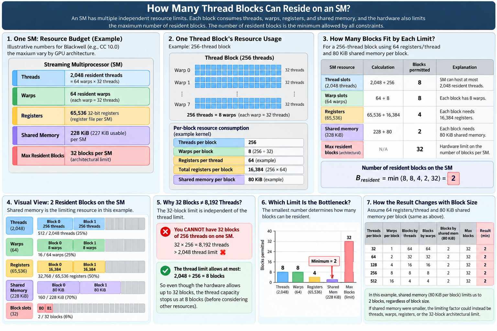

                        GPU
        ┌───────────────────────────────────┐
        │                                   │
        │   ┌──────── SM 0 ────────┐        │
        │   │                      │        │
        │   │  THREAD EXECUTION    │        │
        │   │                      │        │
        │   │  up to 64 warps      │        │
        │   │       ×              │        │
        │   │  32 threads/warp     │        │
        │   │       =              │        │
        │   │  2,048 resident      │        │
        │   │  threads             │        │
        │   │                      │        │
        │   │  ┌────────────────┐  │        │
        │   │  │ Warp 0         │  │        │
        │   │  │ 32 threads     │  │        │
        │   │  ├────────────────┤  │        │
        │   │  │ Warp 1         │  │        │
        │   │  │ 32 threads     │  │        │
        │   │  ├────────────────┤  │        │
        │   │  │ ...            │  │        │
        │   │  ├────────────────┤  │        │
        │   │  │ Warp 63        │  │        │
        │   │  │ 32 threads     │  │        │
        │   │  └────────────────┘  │        │
        │   │                      │        │
        │   │  SM RESOURCES        │        │
        │   │                      │        │
        │   │  Registers           │        │
        │   │  64K × 32-bit        │        │
        │   │  = 256 KB            │        │
        │   │                      │        │
        │   │  L1 / Shared SRAM    │        │
        │   │  256 KB combined     │        │
        │   │                      │        │
        │   │  Shared memory can   │        │
        │   │  use up to ~228 KB   │        │
        │   │  (~227 KB usable)    │        │
        │   │                      │        │
        │   └──────────────────────┘        │
        │                                   │
        │   ┌──────── SM 1 ────────┐        │
        │   │    same resources    │        │
        │   └──────────────────────┘        │
        │                                   │
        │              ...                  │
        │                                   │
        │   ┌──────── SM N ────────┐        │
        │   │    same resources    │        │
        │   └──────────────────────┘        │
        └───────────────────────────────────┘

The most important idea is that those numbers are per SM, not for the whole GPU.  
Think of an SM as a little throughput-processing factory:  

                    ONE SM
                      │
          ┌───────────┴────────────┐
          │                        │
      COMPUTE STATE            FAST MEMORY
          │                        │
     64 warps max          ┌───────┴────────┐
     2048 threads          │                │
                           │                │
                       Registers       L1 / Shared
                        256 KB           256 KB
Each warp is a 32-threads group.

````
Thread Blocks
     │
     ▼
assigned to an SM
     │
     ├── consume THREAD slots
     ├── consume WARP slots
     ├── consume REGISTERS
     └── consume SHARED MEMORY
                │
                ▼
        How many blocks can
        live on the SM at once?
                │
                ▼
            OCCUPANCY
````
For example, suppose our kernel launches a block of 256 threads:  
````
256 threads/block
      ÷
32 threads/warp
      =
8 warps/block
````
Ignoring other constraints, a 64-warp SM could theoretically hold:  
````
64 warps / 8 warps per block
        =
8 resident blocks
````
But now suppose each block asks for a huge amount of shared memory:  
````
~227 KB shared memory available per SM

Block requires 110 KB
        ↓
Only ~2 such blocks fit
        ↓
2 blocks × 8 warps
        =
16 resident warps
````
So although the hardware could track far more warps, shared-memory usage became the limiting resource.  

**Registers + shared memory + large warp/thread capacity allow an SM to keep many threads resident simultaneously, which is what enables GPU thread-level parallelism.**  

Resident warps are the pool of work, and the four warp schedulers decide which ready warps feed the execution pipelines on a given cycle.  NVIDIA’s current Blackwell profiling documentation explicitly refers to the four warp schedulers.  

**Resident work**  
````
up to 64 warps
waiting / ready / stalled
````
**Warp schedulers**  
````
4
independent schedulers
````
**Conceptual max**  
````
4 × up to 2
warp instructions / cycle*
````

Cycle N: schedulers select ready warps  
````
Pool of resident warps
Warp 0
Warp 1
Warp 2
...
Warp 63
Some are ready; others may be waiting on data or dependencies.
````
Each scheduler chooses a ready warp from its scheduling domain  
````
Scheduler 0
selects Warp 7
ADD + LOAD
independent → dual issue
````
````
Scheduler 1
selects Warp 18
FMA
single issue
````
````
Scheduler 2
selects Warp 31
INT + STORE
independent → dual issue
````
````
Scheduler 3
selects Warp 52
LOAD
single issue
````
Instructions flow into different execution pipelines  
````
FP / INT
arithmetic
````
````
Load / Store
memory
````
````
Tensor
matrix operations
````
````
Specialized
other pipelines
````
````
64 resident warps
lots of available thread-level parallelism
|
4 warp schedulers
choose ready warps each cycle
|
Instruction issue
possibly two independent instructions from a selected warp
|
Execution pipelines
arithmetic · memory · tensor · specialized
````
# One Streaming Multiprocessor  
````
┌────────────────────────────── SM ──────────────────────────────┐
│                                                                │
│    Partition 0                       Partition 1                │
│                                                                │
│    Partition 2                       Partition 3                │
│                                                                │
└────────────────────────────────────────────────────────────────┘
````
The four large inner rectangles correspond to the SM's four warp-scheduler partitions.  

## Each quadrant has one warp scheduler  
Each quadrant:  
````
Warp scheduler + dispatch
       32 thread/clk
````
The `32 thread/clk` is significant because:  
`1 warp = 32 threads`  
So conceptually, one scheduler can select a ready warp and issue a warp-wide instruction:  

                Scheduler 0
                     │
              choose Warp 7
                     │
                     ▼
             FP32 instruction
                     │
          ┌──────────┴──────────┐
          T0 T1 T2 ...       T31

All 32 threads in that warp execute the same instruction, subject to masking/divergence.  

## Four schedulers → four warps can issue in the same cycle  
Because the four partitions operate independently:  
````
                 ONE CLOCK CYCLE

Scheduler 0 ──► Warp A ──► FP32
Scheduler 1 ──► Warp B ──► INT32
Scheduler 2 ──► Warp C ──► Tensor
Scheduler 3 ──► Warp D ──► FP32
````
So potentially four different warps are making forward progress simultaneously.  

This is why we should distinguish:  
* up to 64 resident warps = work available on the SM  
* 4 warp schedulers = machinery choosing work  
* up to 4 warps issuing per cycle = instantaneous scheduling throughput  
The 64 resident warps are not all executing simultaneously every clock.  

## Execution Pipelines  
Below each scheduler are execution pipelines.  
*INT32*  
Executes integer instructions such as integer arithmetic, indexing, address calculations, loop counters, etc.  
For example:  
`i = i + 1;`  
might generate integer work.  

*FP32*  
These pipelines execute ordinary single-precision floating-point arithmetic:  
`a+b`  
`a×b+c`  
So ordinary CUDA math may flow here.  

*Tensor Cores*  
These specialize in matrix operations.  
Conceptually:  
`D=A×B+C`  
They are extremely important for transformer workloads, because GEMMs underlying operations such as:  
````
Q = XWq
K = XWk
V = XWv
````
can heavily use Tensor Cores.  

*LD/ST*  
`LD/ST  LD/ST  LD/ST  LD/ST`  
mean Load/Store units.  

Their job is moving data:  
````
memory → registers
registers → memory
````
For example:  
`x = A[i];`  
requires a load.  

So we should mentally separate:  
````
         computation
    INT32 / FP32 / Tensor
          versus
       data movement
          LD/ST
````
That distinction becomes extremely important in GPU performance engineering.  

*SFU*  
Special Function Unit  

It handles certain specialized mathematical operations, traditionally things such as approximations involved in:  
````
sin()
cos()
exp()
reciprocal
sqrt-related operations
````
depending on the particular instruction.  

So each scheduler partition roughly has access to:  

              Warp Scheduler
                    │
        ┌───────────┼─────────────┐
        ▼           ▼             ▼
      INT32       FP32        Tensor Cores
                                   │
                   +
                LD/ST
                   +
                  SFU

## Dual Issue  
Suppose Scheduler 0 is running Warp A.  
Warp A has independent instructions available such as:  
````
Instruction 1: FP32 arithmetic
Instruction 2: memory load
````
If those instructions are independent and the required execution resources are available, the scheduler may issue both:  

                    Warp A
                      │
              ┌───────┴────────┐
              ▼                ▼
           FP32 ADD           LOAD
              │                │
              ▼                ▼
         FP32 pipeline      LD/ST pipeline

That is the math + memory dual-issue concept represented by the diagram.  
The resources can operate in parallel because the instructions target different pipelines.  

### What dual issue does NOT mean  
It is not:  
````
Scheduler
   ├── Warp A → ADD
   └── Warp B → LOAD
````
Rather:  
````
Scheduler
        │
      Warp A
      /    \
   ADD     LOAD
    │       │
   FP32    LD/ST
````
Both issued instructions belong to the same warp.  

Meanwhile another scheduler can independently select another warp:  
````
Scheduler 0 → Warp A → math + memory

Scheduler 1 → Warp B → math

Scheduler 2 → Warp C → Tensor + memory

Scheduler 3 → Warp D → math
````

## Why NVIDIA builds an SM this way  
Imagine the SM currently holds:  
`64 resident warps`  
Some might be stalled:  
````
Warp 0  → waiting on memory
Warp 1  → ready
Warp 2  → dependency stall
Warp 3  → ready
Warp 4  → ready
...
Warp 63 → ready
````
The scheduler doesn't have to wait for Warp 0.  

It can choose a different ready warp:  

                   many resident warps
                          │
             ┌────────────┴────────────┐
             │                         │
        stalled warps              ready warps
                                       │
                                       ▼
                              Warp schedulers
                                       │
                                       ▼
                             execution pipelines
This is latency hiding.  
Instead of requiring one thread to execute incredibly quickly, GPUs keep a huge pool of work available and constantly find something ready to run.  

## Blackwell SM as three layers  
### Layer 1 — Resident work  
````
Up to ~64 warps
       =
2,048 threads
````
Registers and shared memory make it possible to keep all those threads resident.  

### Layer 2 — Scheduling  
````
        4 warp schedulers

Sched 0   Sched 1   Sched 2   Sched 3
   │         │         │         │
 Warp A    Warp B    Warp C    Warp D
````

### Layer 3 — Execution  
```` 
 INT32
 FP32
 Tensor Cores
 LD/ST
 SFU
````
So the entire architecture can be summarized as:  
               BLACKWELL SM

        up to 64 resident warps
                   │
                   │ ready warps
                   ▼
        ┌──────────────────────┐
        │ 4 Warp Schedulers    │
        └──────────────────────┘
          │     │     │     │
          ▼     ▼     ▼     ▼
        Warp  Warp  Warp  Warp
          │     │     │     │
          └─────┴─────┴─────┘
                   │
                   ▼
        ┌───────────────────────┐
        │ Execution resources   │
        │                       │
        │ FP32     INT32        │
        │ Tensor   LD/ST        │
        │ SFU                   │
        └───────────────────────┘

An SM keeps dozens of warps resident, but its four warp schedulers continuously select a small number of ready warps each cycle and dispatch their instructions to specialized execution pipelines; dual issue can let a selected warp use a math and a memory pipeline concurrently.  

## Tracing a Warp  
Let’s follow one specific warp—Warp A—through three scheduler cycles.  
Assume Warp A contains these instructions:  
````
I1: FP32   R3  = R1 * R2
I2: LOAD   R8  = [R20]       ← independent of I1

I3: FP32   R9  = R5 + R6
I4: STORE  [R21] = R9        ← DEPENDS on I3

I5: FP32   R12 = R10 * R11   ← independent
````
The critical dependency is:  
````
I3 produces R9
       │
       ▼
I4 needs R9
````
Now trace the warp.  

### Clock cycle 1 — dual issue succeeds  
The scheduler examines Warp A:  
````
I1: FP32   R3 = R1 * R2
I2: LOAD   R8 = [R20]
````
These two instructions:  
* come from the same warp  
* are independent  
* use different execution resources  
So:  

                    WARP A
                      │
              Warp Scheduler
                      │
               ┌──────┴──────┐
               │             │
               ▼             ▼

          I1: FP32          I2: LOAD
          R3=R1*R2         R8=[R20]
               │             │
               ▼             ▼
          FP32 pipeline    LD/ST pipeline

             SAME CLOCK CYCLE
So cycle 1 gets dual issue:  
`FP32 + LOAD`  
The important idea is not that the warp executes two arbitrary instructions. They must be independent and target compatible resources.  

### Clock cycle 2 — dependency prevents dual issue  
The next two instructions are:  
````
I3: FP32   R9 = R5 + R6
I4: STORE  [R21] = R9
````
At first glance this looks ideal:  
`FP32 + STORE`  
Two different pipelines!  
But look at the data dependency:  
````
        I3
R5 + R6 → R9
           │
           │ required by
           ▼
        I4
STORE [R21] = R9
````
The store cannot be issued alongside the FP32 operation because the value it needs is being produced by that very FP32 instruction.  
Therefore:  
CLOCK 2

                    WARP A
                      │
              Warp Scheduler
                      │
                      ▼

               I3: FP32 ADD
               R9 = R5 + R6
                      │
                      ▼
                FP32 pipeline


              I4: STORE
                  ✕
            cannot issue yet

            waiting for R9
So this cycle is a single issue cycle, rather than `FP32 + STORE`  

Having a free LD/ST pipeline does not mean the scheduler can use it.  

The instruction itself must be ready  

### Clock cycle 3 — dual issue becomes possible again  
For illustration, suppose the result R9 is now available.  
The store is ready:  
`I4: STORE [R21] = R9`  

And the next FP32 instruction is independent:  
`I5: FP32 R12 = R10 * R11`  

So Warp A now has:  

                    WARP A
                      │
               Warp Scheduler
                      │
              ┌───────┴───────┐
              │               │
              ▼               ▼

        I4: STORE          I5: FP32
        [R21]=R9         R12=R10*R11
              │               │
              ▼               ▼
        LD/ST pipeline     FP32 pipeline

              SAME CLOCK CYCLE

Dual issue is possible again:  
`STORE + FP32`  

Visually:  
````
             CLOCK 1             CLOCK 2             CLOCK 3
             ───────             ───────             ───────

Warp A       I1 + I2               I3                I4 + I5
               │                    │                   │
        ┌──────┴──────┐             │            ┌─────┴─────┐
        ▼             ▼             ▼            ▼           ▼
      FP32          LD/ST         FP32         LD/ST        FP32
        │             │             │            │           │
        ✓             ✓             ✓            ✓           ✓

       DUAL ISSUE                 SINGLE              DUAL ISSUE
                               
                              I4 cannot issue
                              because it needs
                              I3's result R9

````
There is one hardware nuance worth keeping in mind: the exact latency of I3 may be more than one clock, so on a real GPU I4 is not guaranteed to become ready specifically in the immediately following cycle. The hardware scoreboard tracks that readiness. This three-cycle example is illustrating the scheduling principle rather than asserting a particular Blackwell FP32 latency.  

And this leads directly to a foundational GPU-performance concept:  
*Dual-issue capability is useful only when the instruction stream contains enough independent work.*  

So when Nsight eventually shows less issue throughput than the theoretical hardware maximum, one possible reason is not lack of execution units at all—it can be instruction/data dependencies preventing the scheduler from feeding those units.  

# SM Residency and Occupancy: How Resource Limits Determine Concurrent Blocks  
  

SM residency resource model: A thread block consumes threads, warps, registers, shared memory, and one block slot. The number of resident blocks is the minimum allowed by all resource constraints.  
In this example, shared memory is the bottleneck. Architectural values shown are illustrative and should be verified for the target GPU.  

## SM Residency and Occupancy: How Resource Limits Determine Concurrent Blocks

A thread block consumes several independent SM resources simultaneously:

- thread slots
- warp slots
- registers
- shared memory
- one resident-block slot

The number of blocks that can reside concurrently on an SM is therefore determined by the **most restrictive resource**:

\[
B_{\text{resident}}
=
\min
\left(
B_{\text{threads}},
B_{\text{warps}},
B_{\text{registers}},
B_{\text{shared}},
B_{\text{block-limit}}
\right)
\]

### Example

Assume:

- 256 threads/block
- 8 warps/block
- 64 registers/thread
- 16,384 registers/block
- 80 KiB shared memory/block

Using the illustrative SM limits:

| Constraint | Calculation | Blocks permitted |
|---|---:|---:|
| Threads | \(2048 / 256\) | 8 |
| Warps | \(64 / 8\) | 8 |
| Registers | \(65536 / 16384\) | 4 |
| Shared memory | \(228 / 80\) | 2 |
| Architectural block limit | hardware limit | 32 |

Therefore:
$[B_{\text{resident}}=\min(8,8,4,2,32)=2]$

Shared memory is therefore the **binding resource**.

The two resident blocks contain:
$[2 \times 8 = 16\text{ resident warps}]$

If the SM supports 64 resident warp slots:
$[\text{Occupancy}=\frac{16}{64}=25\%]$

### Important distinction: block limit vs thread limit

The architectural maximum of 32 resident blocks does **not** mean that 32 blocks of arbitrary size can reside simultaneously.

For example, 32 blocks × 256 threads would require:
$[32\times256=8192\text{ threads}]$
but the SM supports only 2,048 resident threads in this illustrative model.

Therefore the thread-capacity constraint limits 256-thread blocks to:
$[2048/256=8\text{ blocks}]$
before registers or shared memory are even considered.

The maximum-block limit becomes more relevant for very small blocks. For example, with 32-thread blocks, the thread and warp limits might theoretically permit 64 blocks, but a 32-block architectural ceiling would become the limiting factor.

### Performance Engineering Interpretation  

The objective is not simply to maximize occupancy.  

Increasing per-block resource usage may reduce residency but still improve performance if it provides enough benefit.  

Examples:

- More shared memory may reduce HBM/global-memory traffic through better data reuse.
- More registers may increase instruction-level parallelism and avoid register spilling.
- Larger tiles may improve Tensor Core utilization.
- Lower occupancy may still be sufficient to hide latency.

Therefore the real optimization question is:
$[
\boxed{
\text{Does the benefit from additional per-block resources outweigh the loss of concurrency?}
}
]
$  

Occupancy is an important diagnostic metric, but not the final performance objective.  

### Performance Engineering Interpretation

The objective is not simply to maximize occupancy.

Increasing per-block resource usage may reduce residency but still improve performance if it provides enough benefit.

Examples:

- More shared memory may reduce HBM/global-memory traffic through better data reuse.
- More registers may increase instruction-level parallelism and avoid register spilling.
- Larger tiles may improve Tensor Core utilization.
- Lower occupancy may still be sufficient to hide latency.

Therefore the real optimization question is:
$
[
\boxed{
\text{Does the benefit from additional per-block resources outweigh the loss of concurrency?}
}
]
$  

Occupancy is an important diagnostic metric, but not the final performance objective.  
