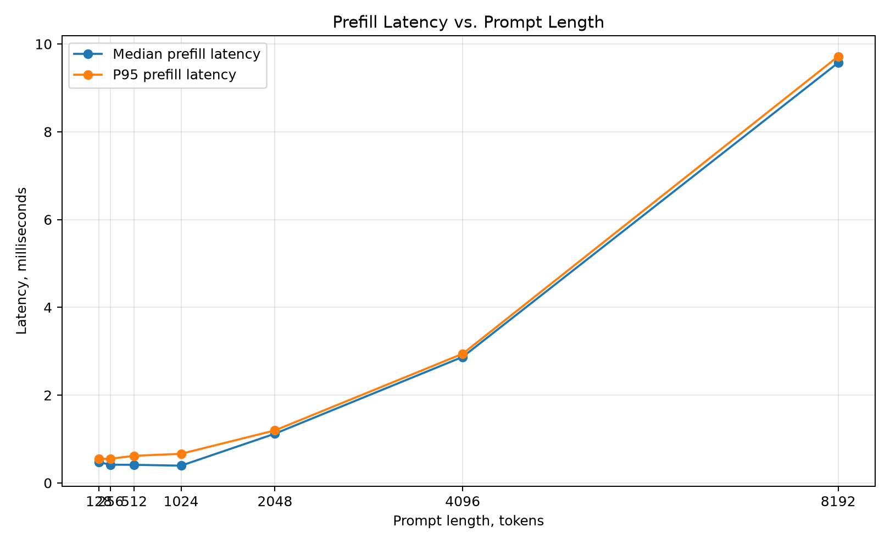
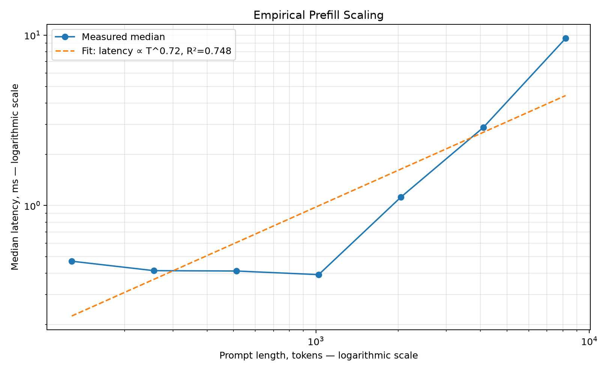
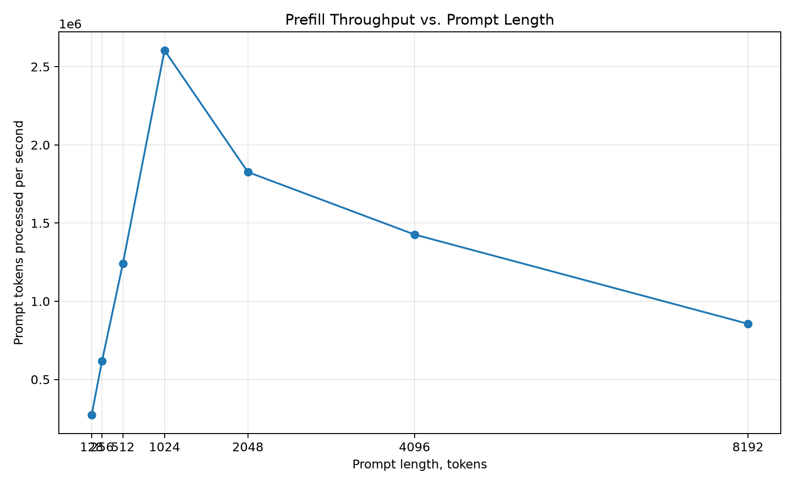

# Two phases of LLM inference  
## Prefill  
For an input prompt such as 2,000 tokens:  
* All prompt tokens are processed together  
* Large matrix multiplications operate over many tokens  
* The KV cache is initially populated  
* GPU parallelism is relatively high  
* Performance is often more compute-bound  

**Primary metric:**  
`TTFT=Time to First Token`  

## Decode  
After prefill, generation happens one token at a time:  
* Only one new token is projected  
* Its query reads the increasingly large KV cache  
* Matrix operations are much smaller  
* GPU utilization can be poor at batch size 1  
* Performance increasingly becomes memory-bandwidth-bound  

**Primary metric:**  
`TPOT=Time Per Output Token`  

This distinction is central to understanding real inference systems. KV cache is not simply “a compute optimization.” It trades recomputation for persistent memory and repeated memory reads.  

# Build a Prefill vs. Decode Performance Lab using your existing transformer  
**Experiment, What to vary**  
Prefill latency, Prompt length: 128, 256, 512, 1024, 2048  
* Decode latency, Current KV-cache length  
* Batch behavior, Batch sizes: 1, 2, 4, 8  
* Cache memory, Sequence length and dtype  
* Arithmetic intensity, MACs divided by bytes moved  
* User-facing latency, TTFT and average TPOT  

Produce these plots:  
1. Prefill latency versus prompt length  
2. Decode time per token versus KV-cache length  
3. KV-cache bytes versus sequence length  
4. Arithmetic intensity: prefill versus decode  
5. Tokens per second versus batch size  

The conceptual result we want to demonstrate is:  
Prefill:  
many tokens × large matrix operations  
→ substantial parallelism  
→ usually compute-heavy  

Decode:  
one token × growing KV cache  
→ small matrix operations plus large memory reads  
→ usually memory-bandwidth-heavy  

# Lab: Prefill Latency vs. Prompt Length  
## Central question  

**How does the latency of transformer prefill change as the input prompt becomes longer, and how does that behavior relate to linear projection work and quadratic attention work?**  
## Why this follows the KV-cache lab  
The KV-cache lab focused on autoregressive **decode**, where the model processes one new token at a time and reuses stored keys and values.  
This lab isolates **prefill**:  
```text
Entire input prompt → one forward pass → initial KV state / first-token readiness
```

Understanding prefill gives you the basis for reasoning about **time to first token (TTFT)**.  

## Learning objectives

After completing this lab, we should be able to explain:  
1. Why Q/K/V/O projection work is linear in prompt length.  
2. Why full self-attention work is quadratic in prompt length.  
3. Why doubling prompt length does not necessarily just double prefill latency.  
4. Why attention-score memory grows quadratically for a naïve implementation.  
5. Why measured latency can differ from theoretical MAC growth.  
6. How to estimate an empirical scaling exponent from a log-log plot.  

## Scope  
The model contains one attention-only transformer block:  

- token embedding  
- Q, K, and V projections  
- causal self-attention  
- output projection  

It deliberately excludes feed-forward layers, layer normalization, residual connections, positional encodings, and a language-model head. This keeps the experiment focused on attention prefill.  

## Hypothesis  
For batch size $B$, prompt length $T$, and embedding dimension $D$:  

$$
\text{Projection MACs} = 4BTD^2
$$

$$
\text{Attention MACs} = 2BT^2D
$$

Therefore:  
- projection work grows as $O(T)$;  
- attention work grows as $O(T^2)$;  
- measured latency should become increasingly nonlinear as prompts grow and attention becomes a larger fraction of total work.  

## Files

```text
02_prefill_latency_vs_prompt_length/
├── README.md
├── hand_calculations.md
├── prefill_latency_lab.py
├── test_prefill_latency_lab.py
└── outputs/
    └── .gitkeep
```

## Run the tests first

From this directory:

```bash
python -m unittest -v
```

The tests verify:

- closed-form MAC accounting;
- quadratic attention growth when prompt length doubles;
- output tensor shape;
- causal behavior;
- percentile calculation;
- power-law fitting.

## Recommended A100 run

```bash
python prefill_latency_lab.py \
  --device cuda \
  --dtype float16 \
  --embed-dim 512 \
  --num-heads 8 \
  --batch-size 1 \
  --prompt-lengths 128,256,512,1024,2048 \
  --warmups 5 \
  --runs 30 \
  --attention-backend manual
```

The `manual` backend explicitly materializes the attention-score matrix. This makes the first-principles tensor shapes visible, but its memory usage grows as $O(T^2)$.

For longer prompts, compare the optimized PyTorch backend:

```bash
python prefill_latency_lab.py \
  --device cuda \
  --dtype float16 \
  --embed-dim 512 \
  --num-heads 8 \
  --batch-size 1 \
  --prompt-lengths 128,256,512,1024,2048,4096 \
  --warmups 5 \
  --runs 30 \
  --attention-backend sdpa \
  --out-dir outputs_sdpa
```

Do not treat this backend comparison as a complete FlashAttention lab. It is only a way to observe that an optimized implementation can have the same logical attention operation while using different kernels and memory behavior.

## Outputs

The script prints aggregated results and saves only PNG plots:

```text
outputs/
├── prefill_latency_vs_prompt_length.png
├── prefill_throughput_vs_prompt_length.png
└── prefill_latency_loglog_fit.png
```

It does **not** save individual timing samples.

### Plot 1: Prefill latency vs. prompt length

This is the primary experiment. Compare median and p95 latency as prompt length increases.

Questions to answer:

- Does latency initially appear close to linear?
- Where does the curve begin bending upward?
- Is p95 close to the median, or is there substantial timing variability?

### Plot 2: Prefill throughput vs. prompt length

This reports prompt tokens processed per second:

$$
\text{Prompt throughput} = \frac{B \times T}{\text{median latency in seconds}}
$$

Throughput may rise initially as larger matrices use the hardware more efficiently. It may later flatten or decline as quadratic attention becomes increasingly expensive.

### Plot 3: Log-log scaling fit

The script fits:

$$
\text{Latency} \approx cT^\alpha
$$

Interpret the fitted exponent cautiously:

```text
alpha near 1 → approximately linear over the measured range
alpha near 2 → approximately quadratic over the measured range
between 1 and 2 → mixed projection/attention behavior plus hardware effects
```

A fitted exponent is a summary of the selected measurement range, not a universal constant for the model.

## Expected conceptual result

When prompt length doubles:

```text
Projection MACs: 2×
Attention MACs:  4×
Score memory:    4×
```

For the simplified block, projection and attention MACs are equal when:

$$
T = 2D
$$

With `embed_dim = 512`, this theoretical crossover occurs around `T = 1024` tokens.

## Experiment worksheet

After running the lab, record your answers:

### Observation 1

At what prompt length does measured latency begin increasing noticeably faster than linearly?

```text
Answer:
```

### Observation 2

What empirical exponent $\alpha$ did the script report?

```text
Answer:
```

### Observation 3

At `T = 1024` and `D = 512`, are projection and attention MACs equal in the script's accounting?

```text
Answer:
```

### Observation 4

How does the manual backend compare with SDPA at longer prompt lengths?

```text
Answer:
```

### Final systems takeaway

Complete this statement in your own words:

> Prefill latency grows with prompt length because...

```text
Answer:
```

# Lab Instructions  
`chmod +x setup_prefill_latency_lab.sh`  
`./setup_prefill_latency_lab.sh`  

The script uses `/workspace/prefill-latency-lab` by default. To choose another location:  
`LAB_DIR=/workspace/my-prefill-lab ./setup_prefill_latency_lab.sh`  

It will:  
* Reuse Nsight Systems when already installed  
* Install Nsight Systems with version fallbacks when missing  
* Detect the Ubuntu version before configuring NVIDIA’s repository  
* Install Python, nano, and required packages  
* Create a virtual environment that can reuse RunPod’s preinstalled CUDA-compatible PyTorch  
* Install PyTorch only when it is genuinely missing  
* Verify CUDA, GPU model, GPU count, VRAM, nvidia-smi, and nsys  
* Stop with a clear error when PyTorch cannot access the GPU.  
* Safely support repeated execution  

After setup, place these files in `/../prefill-latency-lab`:  
`prefill_latency_lab.py`  
`test_prefill_latency_lab.py`  

Then execute:  
`cd /workspace/prefill-latency-lab`  
`source .venv/bin/activate`  

`python -m unittest -v`  
`python prefill_latency_lab.py --help`  

````
python prefill_latency_lab.py \
    --device cuda \
    --dtype float16 \
    --embed-dim 512 \
    --num-heads 8 \
    --attention-backend manual \
    --prompt-lengths 128,256,512,1024,2048,4096,8192 \
    --runs 30
````
````
nsys profile \
  --trace=cuda,nvtx,osrt \
  --sample=none \
  --force-overwrite=true \
  --output=prefill_T512 \
  python prefill_latency_lab.py \
    --device cuda \
    --dtype float16 \
    --embed-dim 512 \
    --num-heads 8 \
    --attention-backend manual \
    --prompt-lengths 512 \
    --warmups 3 \
    --runs 1
    
  nsys stats \
  --report cuda_gpu_kern_sum \
  --format csv \
  --output prefill_T512 \
  --force-overwrite=true \
  prefill_T512.nsys-rep
````
Repeat the above for 1024, 2028, 4096  

# Scaling Factor Calculation  
Start with the assumption that latency follows a power law over some range:  
$L(T) = cT^{\alpha}$  

This is the standard *power-law scaling* form, where:  
* T is the prompt length  
* L(T) is the latency  
* c is a constant  
* α is the scaling exponent  
Now double the prompt length from T to 2T:  
$L(2T) = c(2T)^{\alpha}$  

Expand:  
$L(2T) = c2^{\alpha}T^{\alpha}$  

But from the original equation:  
$L(T) = cT^{\alpha}$  

Therefore:  
$L(2T) = 2^{\alpha}L(T)$  

Divide both sides by L(T):  
$\frac{L(2T)}{L(T)} = 2^{\alpha}$  

Now take the base-2 logarithm:  
$\log_{2}\left(\frac{L(2T)}{L(T)}\right) = \log_{2}\left(2^{\alpha}\right)$  

Because:  
$\log_{2}\left(2^{\alpha}\right) = \alpha$  

we obtain:  
$\boxed{\alpha =
\log_{2}\left(
\frac{L(2T)}{L(T)}
\right)
}
$  

Why this works intuitively  
The ratio  
`L(2T) / L(T)` 
asks:  
When i double the prompt length, by what factor does latency increase?  
The logarithm then converts that growth factor into the exponent.  

## Linear Scaling  
If doubling prompt length doubles latency:  
$\frac{L(2T)}{L(T)} = 2$  

then:  
$\alpha = \log_{2}(2) = 1$  

So:
$L(T) \propto T$  

## Quadratic scaling  
If doubling prompt length quadruples latency:
$\frac{L(2T)}{L(T)} = 4$  

then:  
$\alpha = \log_{2}(4) = 2$  

So:  
$L(T) \propto T^2$  

## Sublinear scaling  
If doubling prompt length increases latency by only 1.5×:  
$\alpha = \log_{2}(1.5) \approx 0.585$  

That means latency is growing more slowly than linearly over that interval.  

E.g. Suppose approximately:  
`L(4096)=2.9 ms`  

and:  
`L(8192)=9.6 ms`  

Since `8192=2×4096`:  
$\alpha = \log_{2}\left(\frac{9.6}{2.9}\right)$  

The latency ratio is approximately:  
`9.6 / 2.9 = 3.31`  

Therefore:  
$\alpha \approx \log_{2}(3.31) \approx 1.73$  

So between 4096 and 8192 tokens, latency behaves approximately like:  
$L(T) \propto T^{1.73}$  
This does not mean the complete system always follows T^1.73.  
It means that over this particular doubling interval, the observed latency growth resembles a power law with exponent approximately 1.73.  

# Projection & Attention Latency Equations  
Let  
* T = prompt length  
* D = embedding dimension  
* H = number of attention heads  
* D_h = D/H = dimension of each head  
* Batch size B=1  
The lab counts *multiply-accumulate operations (MACs)*. For a matrix multiplication  
`[m,k] × [k,n] → [m,n]`,  
the work is approximately  
`mkn MACs`  

The test file encodes the same accounting: four projection matrices contribute `4TD^2`, while the two attention matrix multiplications  
contribute `2T^2 * D`.  

## Deriving projection work: 4TD^2  
The input token representations have shape  
`X:[T,D]`  
Self-attention applies four learned linear projections:  
1. Query projection  
2. Key projection  
3. Value projection  
4. Output projection  

### Query projection  
`Q = XWq`  
where:  
`X:[T,D]`  
`Wq:[D,D]`  

`Q = [T,D] * [D,D] = [T,D]`  
Its cost is: `T * D * D = TD^2`  
The key and value projections have exactly the same cost:  
`K = XWk => TD^2`  
`V = XWv => TD^2`  
So QKV projection work is `3TD^2`  

After the attention heads are concatenated, the output is projected again:  
`O=Concat(heads)Wo` 
where:  
`Concat(heads):[T,D], Wo:[D,D]`  
This costs another:  
`TD^2`  
Therefore total projection work is:  
`3TD^2 + TD^2 = 4TD^2`  

The factor 4 comes from the four D×D linear layers:  
Wq, Wk, Wv, Wo  

## Deriving projection work: 2T^2 * D  
After splitting into heads:  
`Q,K,V:[H,T,Dh]`  
There are two major matrix multiplications inside attention.  

**Step A: Compute attention scores**  
For each head:
$Q_h K_h^{\top}.$  
The shapes are:  
$Q_h: [T,D_h]$  
$K_h^{\top}: [D_h,T]$  
Thus:  
$[T,D_h] x [D_h,T] -> [T,T]$  
The work for one head is:  
$T⋅D_h⋅T = T^2D_h$  
There are H heads:  
$H⋅T^2D_h$  
Because:  
$HD_h = D$  
we get:  
$HT^2D_h = T^2D$  
So attention-score computation costs:  
$T^2D$  

**Step B: Multiply attention probabilities by values**  
After softmax, each head has an attention matrix:  
$A_h:[T,T]$  
It multiplies the value matrix:  
$V_h:[T,D_h]$  
Therefore:  
$[T,T]×[T,D_h] → [T,D_h]$  
The work for one head is:  
$T⋅T⋅D_h=T^2D_h$  
Across all H heads:  
$HT^2D_h=T^2D$  
So the attention-value multiplication costs another:  
$T^2D$  
Adding the two attention matrix multiplications:  
$T^2D + T^2D$  
$2T^2D$  
The factor 2 comes from:  
$QK^T$  
$softmax(QK^⊤)V$  

# Total attention-block MACs  
Combining projections and attention:  
$Total MACs = 4TD^2 + 2T^2D$  
The two terms scale differently:  
$4TD^2∝T$  
because D is fixed, while:  
$2T^2D ∝ T^2$  
Therefore:  
* Projection work grows **linearly** with prompt length  
* Attention work grows **quadratically** with prompt length  

# Why the crossover occurs at T=2D  
Set the two components equal:  
$4TD^2=2T^2D$  
Divide both sides by 2TD:  
`2D=T`  
Therefore:  
`T = 2D`  
For our experiment:  
D=512, 
so:  
`T=2(512)=1024`  
That means around 1024 tokens:  
`projection MACs≈attention MACs`  
Below 1024 tokens, projections represent more of the theoretical work. Above 1024 tokens, quadratic attention increasingly dominates.  

# Analysis  

  
## 1. The curve has two distinct regimes  
### Small prompts: roughly 128–1024 tokens  
Latency is almost flat'ish, actually decreasing from `512 -> 1024`. Overall for this period, it ranges from `0.4 - 0.7 ms`  
That does NOT mean the computational work is constant. As prompt length increases, the model is doing more operations, but the A100 is not yet fully utilized.  
Latency is dominated by factors such as:  
* CUDA kernel-launch overhead  
* Synchronization overhead  
* Memory allocation or framework overhead  
* Insufficient parallel work to saturate the GPU  
* Fixed projection costs
At these sizes, adding tokens gives the GPU more useful work without increasing elapsed time proportionally. This is why GPU throughput can improve while latency remains nearly unchanged.  

## 2. The bend near 1024–2048 is theoretically meaningful  
For this configuration:  
`D=512`  
Projection work scales approximately as:  
$4TD^2$  
Attention work scales approximately as:  
$2T^2D$  
They become equal when:  
$4TD^2=2T^2D$  
`T=2D=1024`  
So around 1024 tokens, the quadratic attention component becomes comparable to the linear projection component.  

That matches the shape of your graph:  
* Before roughly 1024: relatively flat  
* After roughly 1024: latency begins bending upward  
* At 4096 and 8192: attention increasingly dominates  
This is probably the most important conceptual observation from the chart.  

## 3. The larger lengths show increasingly superlinear growth  
Using approximate values from the plot:  

| Prompt-length change | Median latency change | Approximate local exponent |  
| -------------------- | --------------------: | -------------------------: |  
| 2048 → 4096          |     ~1.2 ms → ~2.9 ms |     ( \alpha \approx 1.3 ) |  
| 4096 → 8192          |     ~2.9 ms → ~9.6 ms |     ( \alpha \approx 1.7 ) |  

The local exponent comes from:  
$α=log_2(L(2T)/L(T))$  
For purely quadratic behavior, doubling T would quadruple latency:  
$l(2T)/L(T) = 4 => α = 2$  
Our curve has not reached a perfect `T^2` latency regime, but is moving toward it:  
`α: 1.3 -> 1.7`  
That is exactly what we might expect as fixed overhead and linear projection work become less important relative to quadratic attention.  

## 4. Why 8192 does not simply take four times as long as 4096  
Doubling prompt length quadruples the attention matrix size, but total elapsed time does not have to quadruple exactly.  
The GPU may become more efficient at larger workloads because:  

* larger matrix multiplications use the GPU more effectively  
* Tensor Cores become better utilized  
* launch overhead becomes a smaller fraction of total time  
* memory operations may be more efficiently amortized  
* multiple components of the block have different scaling behavior  

Therefore:  
`operation growth != exact latency growth`   
The theoretical work approaches quadratic growth, while actual latency reflects both work and hardware efficiency.

## 5. Median and p95 are very close  
At 2048, 4096, and 8192, the median and p95 curves are close together.  
That is encouraging because it indicates:
* low run-to-run variability  
* stable GPU execution  
* few major latency outliers  
* sufficient warmup  
* a relatively controlled environment  

The separation appears slightly larger around 512–1024. That region may be more sensitive to fixed overhead, GPU clock changes, or kernel-selection boundaries.  

## Main conclusion  
Prefill latency remains nearly flat for short prompts because fixed overhead and GPU underutilization dominate.  
Around T=1024, where attention work becomes comparable to projection work for D=512, latency begins increasing more rapidly.  
At larger prompt lengths, the observed scaling becomes increasingly superlinear and moves toward the quadratic behavior predicted by full causal attention.  

  
This chart is particularly valuable because it shows the other side of the latency curve.  
First the GPU becomes more efficient as the problem gets larger, then the quadratic work overwhelms that efficiency.  

## 1. What exactly is this throughput?  
For batch size 1, our lab is effectively computing:  
$Prompt throughput(T) = T / L(T)$  
where L(T) is prefill latency in seconds.  
For example, around `T=8192`, your latency chart showed roughly:  
$L(8192)≈9.5ms=0.0095s$  
Therefore:  
$Throughput=8192/0.0095 = 862,000 tokens/s$  
which is almost exactly what this graph shows.  
So this graph isn't independent of the latency graph. It is another way of looking at the same measurements.  

## 2. First half: throughput keeps increasing  
Approximately:  

|  (T) |  Throughput |
| ---: | ----------: |
|  128 | 0.30M tok/s |
|  256 | 0.62M tok/s |
|  512 | 1.24M tok/s |
| 1024 |  2.6M tok/s |  


Every time we approximately double T:  
`128→256→512→1024`  
throughput also roughly doubles.  
Why?  
Because from our previous latency chart:  
$L(T)≈constant$  
over much of this region.  

If latency is approximately 0.4 ms regardless of whether you process 128 or 1024 tokens, then:  
$throughput = T / roughly constant$  
so throughput grows approximately linearly with T. This is classic GPU utilization/amortization behavior.  
At 128 tokens, we're giving an A100 a relatively small amount of work. The GPU has enormous compute capacity that we're not exploiting.  

At 256: More useful work, almost the same elapsed time   
At 512: More useful work again, almost the same elapsed time    
At 1024: We're doing substantially more work, but the GPU is utilizing its parallel resources much more efficiently  

That's why:  
**more work can actually produce higher throughput**  
even though it cannot indefinitely produce lower latency.  

## 3. Something changes around 1024  
Our throughput reaches its maximum:  
`~2.6 million prompt tokens/sec`  
around: `T = 1024`  
and then starts falling:  
`1024→2048:2.6M→1.83M`  
`2048→4096:1.83M→1.43M`  
`4096→8192:1.43M→0.86M`  
Why?  
Because increasing T is now causing latency to grow faster than prompt length.  
And we can prove that mathematically.  

## 4. Connect this directly to the scaling exponent  
Earlier we assumed:  
$L(T) ∝ T^α$  
Throughput is:  
$R(T) = T / L(T)$  
Substitute:  
$R(T) ∝ T / T^∝$  
Using exponent rules:  
$R(T) ∝ T^(1-∝)$  
This equation gives us an extremely useful systems insight.  

**If latency is sublinear**  
Suppose:  
$α < 1$  
Then:  
$1 − α > 0$  
so throughput increases with prompt length.  
That's approximately our 128–1024 region.  

**If latency is linear**  
If:  
`α = 1`  
then:  
$R(T) ∝ T^0$  
and:  
$T^0 = 1$  
So throughput becomes roughly constant.  

**If latency is superlinear**
If:
$α > 1$  
then:  
$1−α < 0$  
Therefore throughput declines as prompt length increases.
That's what we see after roughly 1024.  

## 5. Now connect it to the attention math we derived  
We previously derived total MACs:  
$MACs = 4TD^2 + 2T^2D$  
with D=512.  
And we found the crossover:  
$T = 2D = 1024$  
At roughly T=1024:  
$projection MACs ≈ attention MACs$  
Beyond that:  
$2T^2D$  
becomes increasingly important.  
So there is a very nice correspondence in our experiment.  

**Before ~1024**  
GPU efficiency gains dominate:  
$more tokens→better utilization→higher throughput$  
Around ~1024  
You hit approximately the best balance:  
$high GPU utilization + quadratic cost not yet overwhelming$  
**Beyond ~1024**  
Quadratic attention increasingly dominates:  
$T ↑⇒ T^2 attention work ↑↑$  
Latency therefore grows superlinearly:  
$L(T) ↑↑$  
and eventually:  
$T / L(T) ↓$  
so throughput falls.  

## 6. Think about 4096 → 8192  
This is probably the clearest example.  
Prompt length doubles:  
`4096 → 8192`  
That's:  
`2×tokens`  
But latency goes approximately:  
`2.9 ms → 9.6 ms`  
or:  
`∼3.3×`  
Therefore throughput must fall:  
$(2 x tokens / 3.3 x time) = 0.61$  
So we'd expect throughput at 8192 to be roughly:  
`61%`  
of throughput at 4096.  
From the plot:  
$0.86M / 1.43M = 60%$  
Beautiful agreement.  

## The deeper systems lesson  
This graph demonstrates something fundamental about accelerators:  
**Maximum throughput does not necessarily occur at minimum workload size**  
There is usually a sweet spot.  
Small workloads suffer from:  
`underutilization + fixed overhead`  
Large workloads suffer from:  
`growing algorithmic work`  
Somewhere in between:  
`hardware utilization is high while algorithmic cost is still manageable`  
and throughput peaks.  

# nsys Profile Analysis  
## High-level Summaries  
````
nsys stats \
  --report cuda_gpu_kern_sum \
  --report cuda_api_sum \
  --report cuda_gpu_mem_time_sum \
  prefill_nsys.nsys-rep
````
This report provides kernel time, CUDA API time, and GPU memory-operation time  
Things to look out for:  
* Which kernels consume most GPU time  
* Whether GEMM/matmul kernels dominate  
* Whether softmax/masking kernels are visible separately  
* How many times each kernel launches  
* Average duration per kernel  
* Whether there are many tiny kernels versus a few large kernels  

For our manual attention implementation, I’d expect the broad structure to reflect something like:  
$Q,K,V projections→QK^T→mask/softmax→AV→W_O$  

## Nsight Systems Analysis — Prefill Scaling

## Experiment

Profile one attention-only transformer block on an NVIDIA A100 while varying prompt length:

- Batch size: `B = 1`
- Embedding dimension: `D = 512`
- Heads: `H = 8`
- dtype: `float16`
- Attention backend: manual/materialized attention
- Prompt lengths: `T = 512, 1024, 2048, 4096`
- Each Nsight capture: 3 warmups + 1 timed iteration

The manual attention path is:

$$
QK^T
\rightarrow
\text{scale}
\rightarrow
\text{causal mask}
\rightarrow
\text{softmax}
\rightarrow
AV
$$

The theoretical arithmetic model is:

$$
\text{Projection MACs} = 4TD^2
$$

$$
\text{Attention MACs} = 2T^2D
$$

**Therefore, projection work grows linearly with prompt length, while attention work grows quadratically.**

For $D = 512$, the theoretical crossover occurs when:

$$
4TD^2 = 2T^2D
$$

which gives:

$$
T = 2D = 1024
$$

---

## Measured GPU Kernel Behavior

The following numbers exclude one-time setup kernels such as causal-mask construction and represent approximately one forward pass.

| Prompt Length | GPU Kernel Time | Growth vs Previous | Attention-Path Share |
| ------------: | --------------: | -----------------: | -------------------: |
|           512 |          ~91 µs |                  — |                 ~54% |
|          1024 |         ~222 µs |              2.43× |                 ~73% |
|          2048 |        ~1.00 ms |              4.52× |                 ~92% |
|          4096 |        ~2.77 ms |              2.77× |                 ~95% |

The measured profile therefore shows a clear transition from a mixed projection/attention workload at short prompts to an overwhelmingly attention-dominated workload at long prompts.

## Key Conclusions

### 1. The theoretical crossover is visible in the real GPU profile

At $T = 512$, projection GEMMs are still a major contributor to execution time.

By $T = 1024$, which is exactly the theoretical crossover $T = 2D$, attention-related kernels already dominate GPU execution.

At $T = 2048$ and $T = 4096$, approximately 92–95% of repeated GPU kernel time belongs to the attention path.

The simple MAC model therefore correctly predicts the **direction of the bottleneck transition**.

---

### 2. Projection latency does not scale directly with projection MAC count

Approximate projection-GEMM time per forward:

|    T | Projection GEMMs |
| ---: | ---------------: |
|  512 |          30.1 µs |
| 1024 |          40.9 µs |
| 2048 |          50.4 µs |
| 4096 |          82.0 µs |

Although projection MACs double whenever $T$ doubles, kernel latency grows by substantially less than 2× over much of the range.

This is an important GPU-performance lesson:

$$
\text{more arithmetic}
\not\Rightarrow
\text{proportionally more latency}
$$

Larger matrix operations can make better use of the GPU and amortize fixed overheads.

---

### 3. Operations over the score matrix expose the quadratic behavior very clearly

The manual implementation materializes the attention-score tensor:

$$
[B, H, T, T]
$$

When $T$ doubles, this tensor contains 4× as many elements.

From $T = 2048 \rightarrow 4096$:

$$
\text{scale}: 78.8\ \mu\text{s}
\rightarrow
310.4\ \mu\text{s}
$$

which is:

$$
3.94\times
$$

and:

$$
\text{masked fill}: 192.6\ \mu\text{s}
\rightarrow
763.0\ \mu\text{s}
$$

which is:

$$
3.96\times
$$

Both are almost exactly the expected 4× increase.

This is direct empirical evidence of the cost of operating over a materialized $T^2$ attention matrix.

---

### 4. Kernel dispatch can create performance cliffs

Softmax changed implementation between $T = 1024$ and $T = 2048$.

At 1024, PyTorch used:

`softmax_warp_forward`

At 2048 and 4096, it used:

`cunn_SoftMaxForwardSmem`

Softmax latency changed from approximately:

$$
43.6\ \mu\text{s}
\rightarrow
438.8\ \mu\text{s}
$$

between 1024 and 2048, which is:

$$
\approx 10.1\times
$$

despite prompt length increasing only 2×.

The implementation switch coincides with this large performance discontinuity. It should not be interpreted as proof that the kernel switch alone caused the entire increase, but it demonstrates why real GPU latency can contain sharp regime changes that are invisible in Big-O analysis.

Once already using the shared-memory implementation:

$$
438.8\ \mu\text{s}
\rightarrow
1050.6\ \mu\text{s}
$$

from 2048 to 4096, or only about 2.4×.

---

### 5. Algorithmic complexity is not a latency model

Doubling prompt length produced:

| Prompt-Length Change | Measured Latency Growth |
| -------------------: | ----------------------: |
| $512 \rightarrow 1024$ | 2.43× |
| $1024 \rightarrow 2048$ | 4.52× |
| $2048 \rightarrow 4096$ | 2.77× |

So measured latency does **not** follow a smooth quadratic curve.

A better mental model is:

> **Algorithmic work → tensor shapes → kernel selection → GPU utilization / memory behavior → latency**

Big-O analysis tells us how the amount of work grows. Profiling tells us how that work actually executes on the hardware.

---

## Main Takeaway

As prompt length grows, the bottleneck moves decisively away from the linear Q/K/V/O projections and toward the quadratic attention-score path.

For this manual attention implementation:

> **Long-context prefill cost is dominated by materialized attention.**

The experiment demonstrates why optimizing long-context attention requires more than making GEMMs faster: eliminating or reducing the cost of materializing and repeatedly traversing the $T \times T$ score matrix becomes increasingly important.

# Decode Scaling and KV Cache  
Companion to the prefill lab  
Same learning method: `derive -> predict -> measure -> profile -> explain`  

The main question this lab should answer:  
**"How does the latency of generating on token change as the existing KV cache/context grows"**  

We’ll hold everything else constant:  
````
B = 1
D = 512
H = 8
Dh = 64
dtype = fp16
GPU = A100
context lengths L = 512, 1024, 2048, 4096, 8192
````
Unlike prefill, we process one new token at a time.  

## First-principles model  
During decode, the new query has shape:  
`Q:[B,H,1,D_h]`  
while the existing cache contains:  
````
K_cache:[B,H,L,D_h]
V_cache:[B,H,L,D_h]
````
produces:  
`[B,H,1,L]`  

rather than prefill's:  
`[B,H,T,T]`  

That is the fundamental difference.  

### QK attention work  
Per head:  
$1 \times D_h \; @ \; D_h \times L$  
costs:  
$LD_h$ MACs  

Across H heads:  
$HLD_h = LD$  

because:  
$HD_h = D$  

Then AV costs another:  
`LD`  

Therefore:  
`Decode attention MACs = 2BLD`  

So decode attention is linear in context length:  
`O(L)`  
per generated token.  

Compare that with prefill:  
$O(T^2)$ for attention  

### Projection work behaves differently too  
For one new token, Q/K/V/O projections each cost:  
$D^2$  
Therefore:  
$Decode projection MACs = 4BD^2$  

Notice what disappeared: `T`  

**Projection work per generated token is essentially constant with respect to context length.**  

So our decode model is:  
$Total Decode MACs = 4BD^2 + 2BLD$  

For our configuration:  
`B=1,D=512`  

we get:  
$4D^2 = 1,048,576$  
projection MACs per token.  

Attention becomes:  
`2LD=1024L`  

Interestingly, equality again occurs at:  
$4D^2=2LD$  
giving:  
`L = 2D = 1024`  

But—and this will be important—the latency behavior will likely look very different from the prefill crossover because these decode matrix operations are tiny and the KV cache must be repeatedly read.  

### KV-cache traffic is the other major prediction  
Each cached token contains K and V.  
Number of cached elements: `2BLD`  

For FP16:  
`2 bytes/element`  

So:  
`KV bytes=2BLD × 2`  

With `B=1,D=512`:  
`KV cache = 2048L bytes`  
per transformer layer.  

That gives:  

| Context (L) | K+V cache per layer |
| ----------: | ------------------: |
|         512 |               1 MiB |
|        1024 |               2 MiB |
|        2048 |               4 MiB |
|        4096 |               8 MiB |
|        8192 |              16 MiB |

That's only for our single synthetic attention block.  
A real model with, say, dozens of layers multiplies this substantially.  
And every decode step must access the historical K/V state again.  
That leads to our central hypothesis:  
$$
L \uparrow
\;\Rightarrow\;
\text{KV-cache traffic} \uparrow
\;\Rightarrow\;
\text{decode latency/token} \uparrow
$$
approximately linearly in the simple algorithmic model.  

## Predictions before touching the GPU  
Let's record these now so we don't retrofit explanations after seeing the measurements.  

### Prediction A  
As: `L → 2L`  
attention MACs should approximately double:  
`2LD → 4LD`  
Not quadruple like prefill.  

### Prediction B  
KV-cache bytes read should approximately double.  

### Prediction C  
Projection work should remain approximately constant.  

### Prediction D  
Latency probably will not scale exactly 2×.  

Just like the prefill lab:  
`algorithmic work != latency`  

### Prediction E  
Decode should expose much poorer compute utilization than prefill.  
Prefill could issue large GEMMs involving hundreds or thousands of tokens.  
Decode is fundamentally operating on 1 token. That makes it harder to fill a massive A100 with useful computation.  

### Prediction F  
As context becomes long, we expect KV-cache movement to become increasingly important.  
This is the hypothesis that will eventually connect directly to `arithmetic intensity` and `Roofline`  

## Measurements  
The unprofiled benchmark should collect:  
* `median latency per generated token`  
* `p95 latency per generated token`  
and:  
`decode tokens/sec = 1000 / (latency (ms) / token)`  

## The comparison we're ultimately building  
At the end we should be able to write:  
$Prefill attention = O(T^2)$  
versus:  
$Decode attention/token = O(LD)$  
but then discover experimentally that this is only the beginning of the performance story.  

Prefill taught us:  
`Large amounts of arithmetic can map efficiently to GPUs`  

Decode should teach us something closer to:  
`Small sequential computations with repeatedly accessed state can be much harder to execute efficiently on GPUs`  
And that is exactly the right setup for GPU Architecture Foundations.  


