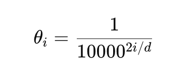

# RoPE Geometry  
Rotation matrix that rotates vectors in 2D space.  

## Key Formulas  
  

## Single Q/K Vector versus entire Q/K Matrix  
### Single Token  
Suppose we have one token with d=4:  

After projection:  
  

This is a single query vector.  

RoPE operates on this vector by rotating:
* (q0, q1)  
* (q2, q3)  
independently.  

## Fundamentals of RoPE Geometry  
Suppose vector v = [1,0]. This vector points directly right on x-axis. We want a mathmatical operation that rotates this vector counter-clockwise. 
This is where the concept of Rotation Matrix comes in. The matrix:
  

This is the standard rotation matrix from linear algebra. 

## What is a Matrix Geometrically  
A matrix fundamentally is a geometric transformation. Some matrices:  
* Stretch vectors  
* Shrink vectors  
* Reflect vectors  
* Shear vectors  
* Rotate vectors  (This is what the rotation matrix does)  

## The Deep Intuition  
Suppose v = v = [1,0]. Then R(theta) means: rotate v by angle theta  

## Why cosine and sine appear  
Points on a unit circle are (cos(theta), sin(theta)). Rotation fundamentally involves circular geometry. So sine / cosine naturally emerge.  

Example:  
theta = pi / 2 = 90 degree rotation  
cos(theta) = 0  
sin(theta) = 1  

R(theta) =  
```text    
⎡0 -1⎤  
⎢1 0⎥    
```  

v = 
```text    
⎡1⎤  
⎢0⎥    
```  

R(theta) * v =  
```text    
⎡0⎤  
⎢1⎥    
```  
Vector v now points upwards. 90 degree rotation counter-clockwise.  
Rotation preserves:  
* Vector magnitude  
* Distances  
* Geometry  

Meaning:  
* Semantic info preserved  
* Orientation changes  

## Connection to RoPE  
R(theta) is the mathematical engine doing the rotation. Take K,Q vectors and rotate them based on token position.  

## Why this RoPE Geometry Works for Attention  
Attention relies on:  
* Vector Similarity  
* Dot Products  

By Rotating Vectors:  
* Nearby positions remain aligned  
* Far positions diverge angularly  

Thus:  
Relative position becomes geometric angular difference. This is the core RoPE insight.  

## Mental Model  
Vector meaning = semantic context  
Rotation angle = token position  
RoPE keeps the meaning intact while encoding positions through orientation.  

## Note about Rotation Matrix  
It rotates vectors by angle theta  

## Radians vs. Degrees  
In programming and math libraries, angles are usually measured in radians and NOT degrees.  

## Relation between Degrees and Radians  
Degrees, Radians  
* 30 degree, pi / 6  
* 45 degree, pi / 4  
* 90 degree, pi / 2  
* 180 degree, pi  
* 360 degree, 2 * pi  

`position theta = base_theta * position`  

larger position = larger rotation angle
RoPE fundamentally maps token position to rotation angle. Query / Key vectors rotate by that angle. So token positions become geometric orientations.  

Nearby tokens have SMALLER relative angle difference. Because of that:  
* Vectors remain more aligned  
* Their dot product stay higher  
* Attention similarity tends to be higher  

Suppose each token position rotates vectors by 30 degree  
Position, Rotation Angle  
* 0, 0  
* 1, 30  
* 2, 60  
* 3, 90  

The core RoPE mechanism is that relative position become relative angular difference. Then attention naturally interprets:  
* nearby angles -> high similarity  
* far angles -> lower similarity  
Nearby tokens have smaller relative angle difference.  

Attention fundamentally measures:  
* vector alignment  
* similarity  
* dot products  

RoPE converts token distance into angular distance.  

## The Big Picture  
RoPE computes a rotation angle for each token position and each frequency pair in the token dimension.  
The angle is:  
  
Properties:  
* Creates multiple frequencies  
* Lower dimensions rotate faster  
* Higher dimensions rotate slower  
* This creates multi-scale positional information  
* Fast frequencies capture local structure  
* Slow frequencies capture broader structure  
* The combination produces unique positional fingerprints  

For token at position m:  
* rotation angle for position m = m * theta(i)  
m = token position  
i = frequency pair index  
d = embedding dimension  
theta(i) = base angular frequency for dimension pair  

For a given token position m, different dimension pairs rotate at different speeds.  

### Example:  
d = 4 => two rotation pairs  
RoPE groups dimension into pairs  

Pair(i), Dimension  
i=0, {0,1}  
i=1, {2,3}  

#### First Frequency Pair  
For i = 0, theta(i) = 1 / 10000^0 = 1  
So base rotation increment for pair 0 = 1 radian per token  

First frequency pair  
Position m, Rotation angle for pair 0  
0, 0  
1, 1*1 = 1 radians  
2, 2*1 = 2 radians  
3, 3*1 = 3 radians  
So the angle increases linearly with positions  

#### Second Frequency Pair  
For i = 1, theta(i) = 1 / 10000^(2/4) = 0.01  

Position m, Rotation angle for pair 1  
0, 0  
1, 1 * 0.01 = 0.01  
2, 2 * 0.01 = 0.02  
3, 3 * 0.01 = 0.03  

Angle still increases linearly but very slow rotation.  
RoPE creates multiple rotating clocks. Some  
* Rotate fast and capture local detail  
* Others rotate slower and capture broader positional structure  

Clock hands analogy:  
* seconds hand  
* minutes hand  
* hours hand  

### Different Frequencies Matter  
If only one rotation speed existed: Position would wrap around circle ambiguously. Multiple frequencies solve this. Together they create rich multi-scale positional fingerprints.  
token_position = rotational phase shift  
Attention similarity becomes Angular similarity  

#### Example: "The cat sat down"  
tokens=4, d=2
Token, Position  
* The, 0  
* cat, 1  
* sat, 2  
* down, 3  

Now suppose all tokens start with the same embedding: 
q =  
[1  
 0]  

Meaning, all 4 tokens start from pointing right.  Now RoPE will rotate them based on position.  Rotation speed:  
Lets use theta = 30 degree per token position.  In radians: theta = pi / 6  
Compute rotation angles:  
Token 0: "The", m=0, angle => 0 * 30 degree = 0  

Rotated vector =  
[1  
 0]  
which is unchanged  

Token 1: "cat", m=1, angle => 1 * 30 degree = 30  
Rotation Vector =   
[cos30 -sin30  
 sin30 cos30]  

Rotated vector =  
[.866  
 .5]  

Token 2: "sat", m=2, angle => 1 * 60 degree = 60  
Rotation Vector =   
[cos60 -sin60  
 sin60 cos60]  

Rotated vector =  
[.5  
 .866]  

Token 3: "down", m=3, angle => 1 * 90 degree = 90  
Rotation Vector =   
[cos90 -sin90  
 sin90 cos90]  

Rotated vector =  
[0  
 1]  

Sequence order becomes rotation.  

### Attention Similarity  
Attention compares vectors via dot products. Compare nearby tokens "cat" vs. "sat" (30 degree versus 60 degree) with delta = 30 degree.  
dot product: .866(.5) + .5(.866) = .866 // This is high similarity.  

Compare farther tokens:  
"The" vs. "down"  = 0 degree versus 90 degree. diff = 90 degree  
dot product = 1(0) + 0(1) = 0  // This is low similarity.  

* Position became rotation  
* Relative distance became angular difference  
* Angular distance affected vector similarity  
* Attention relatively becomes relative-position aware  

In real RoPE, Queries and Keys both rotate  
R^T(m) * R^T(n) = R(n-m) // It makes attention depend on relative offset.  

### More Examples  
Sentence: 
`The cat sat down`  
4 tokens, each token being of 4D (4 dimensions)  

Given d=4, we would have 2 rotation pairs  
Dimensions, Pair index i  
(0,1), 0  
(2,3), 1  

Compute base angular frequencies (1 per pair)  
`theta(i) = 1 / 10000^2i/d`  

1st pair (i=0):  
Theta(0) = 1 / 10000^0 = 1  // Rotates faster  
Theta(1) = 1 / 100000^2/4 = 1 / 100 = 0.01  // Rotates slower  

Pair(i=0) => 1 radian / token (fast clock)  
Pair(i=1) => 0.01 radian / token (slow clock)  

Initial Vector:  
Suppose all embedding vectors  
v = [1  
     0  
     1  
     0] 
Meaning: Pair i=0 starts at angle 0, i=1 also starts at angle 0  

#### Rotations  
##### Positon 0 - "The"  
Pair, Rotation angle  
i=0 (fast), 0 (pos) x 1 (base_angle at i=0) = 0 radian  
i=1 (slow), 0 (pos) x 0.01 (base_angle at i=1) = 0 radian  

Rotation vector:  
[cos(m * theta)  -sin(m * theta)  
 sin(m * theta)  cos(m * theta)]  

where :  
m is the absolute position of the token in the sequence  

Rotation vector for pair i = 0:  
[cos(0 * 1)  -sin(0 * 1)  
 sin(0 * 1)  cos(0 * 1)]  

[1  0  
 0  1]  
This is the identity matrix, meaning it performs no rotation at all. It is exactly what we would expect for a rotation by 0 radians  

Rotation vector for pair i = 1:  
[cos(0 * 0.01)  -sin(0 * 0.01)  
 sin(0 * 0.01)  cos(0 * 0.01)]  

[1  0  
 0  1]  

Rotated vector:  
[ 1  
  0  
  1  
  0]  

##### Positon 1 - "cat"  
Pair, Rotation angle  
i=0, 1x1 = 1 radian  
i=1, 1x.01 = .01 radian  

Rotation vector for pair i = 0:  
[cos(1 * 1)  -sin(1 * 1)  
 sin(1 * 1)  cos(1 * 1)]  

[0.54030231  -0.84147098  
 0.84147098   0.54030231]  

Rotated vector for pair 0:  
[ 0.540  
  0.841]  

Rotation vector for pair i = 1:  
[cos(1 * 0.011)  -sin(1 * 0.01)  
 sin(1 * 0.01)  cos(1 * 0.01)]  

[0.99995  −0.00999983  
0.00999983 0.99995]  

Rotated vector for pair 1:  
[ 0.99995  
  0.01]  

Rotated vector:  
[ 0.540  
  0.841  
  .99995  
  .01]  
Notice: the first pair is fast rotating, and the 2nd pair is slow rotating  

##### Positon 2 - "sat"  
Pair, Rotation angle  
i=0, 2x1 = 2 radian  
i=1, 2x.01 = .02 radian  

Rotation vector for pair i = 0:  
[cos(2 * 1)  -sin(2 * 1)  
 sin(2 * 1)  cos(2 * 1)]  

[-.416  -0.909  
 0.909  -0.416]  

Rotated vector for pair 0:  
[ -.416  
  0.909]  

Rotation vector for pair 1:  
[cos(2 * .01)  -sin(2 * .01)  
 sin(2 * .01)  cos(2 * .01)]  

[.9998  -0.01   
 0.01   0.999]  

Rotated vector for pair 1:  
[ .9998  
  0.02]  

Rotated vector:  
[ -.416  
  .909
  .9998
  .02]  

#### Fast Dimensions  
Position, Fast Rotation  
0, 0  
1, 1 rad  
2, 2 rad  
3, 3 rad
These capture local distinctions and nearby token structure  

#### Slow Dimensions  
Position, Fast Rotation  
0, 0  
1, 0.01 rad  
2, 0.02 rad  
3, 0.03 rad
These capture broad / global positions 

## Additional Examples  
Now suppose sentence:  
`The cat sat down`  
4 tokens, each token being of 4D (4 dimensions)  

  

where each row is a query vector.  

For example:  
  

Shape:  
4x4 (sequence_length * head_dimension)  

### Where Does RoPE Apply  
RoPE does NOT rotate the entire matrix as one object.  

Instead:  
For row 0:  
* rotate using position 0.  
For row 1:  
* rotate using position 1.  
For row 2:  
* rotate using position 2.  
For row 3:  
* rotate using position 3.  

#### Visual Picture  
Before:  
  

RoPE applies:  
R0 to first row, R1 to 2nd row, R2 to third row, R3 to fourth row  
where R is the rotation matrix  

#### Real LLM Example  
Suppose:  
* sequence_length = 8192  
* head_dim = 128  

Then:  
Q = 8192 x 128  for one attention head  

RoPE would process 8192 rows  
Within each row, 64 independent 2D rotation, because 128/2 = 64 dimension pairs   

#### Mental Model  
Think of RoPE as:  
for every token position:  
    for every dimension pair:  
        rotate that 2D pair  

#### Then Attention Happens  
Only AFTER RoPE modifies Q and K do we compute: QK^T  
The flow is:  
  

RoPE is fundamentally a per-token vector transformation.  

Attention is fundamentally a matrix operation across all tokens.  

### Explanation of Attention-style similarity matrix: Q_rope @ Q_rope.T  shown in `q_matrix_rope_lab.py`  
Q_rope @ Q_rope.T means Q_rope matrix_mul Q_rope.T  

Lets use 4-Token Sentence  
`The cat sat down`  

Suppose after RoPE we have:  
  

where: each row is one token's rotated query vector.  

Shape: 4 x d  

#### What is Q_rope.T?  
Transpose means rows become columns.
So Q_rope.T has shape d x 4  

Multiply them gives 4 x 4 shape, because (4×d)(d×4) = 4×4  

Each cell contains , which is dot product between token i and token j  

#### Visual Picture  
  

Every cell is a similarity score.  

Attention is fundamentally asking "How similar is every token to every other token?". This matrix answers that question.  

#### Example  
Suppose "The cat sat down"  

After RoPE:  
Maybe "cat" and "sat" have similar orientations.  
Then  will be high.  

But "The" and "down" might have very different orientations.  
Then  will be low. 

RoPE modifies vector orientations before these dot products are computed.  

RoPE directly changes the entries of:   

E.g attention dot product matrix (after RoPE was applied to the vectors)
  

Interpretation:  
* same token position → 2.0000  
* 1 position apart → 1.5403  
* 2 positions apart → 0.5837  
* 3 positions apart → 0.0096  

So RoPE made similarity decrease as relative distance increased.  

Also notice the diagonals:  
* main diagonal: 2.0000  
* one-off diagonal: 1.5403  
* two-off diagonal: 0.5837  
* three-off diagonal: 0.0096  

This means the score depends on relative offset, not absolute position.  

For example:  
* The ↔ cat = 1.5403  
* cat ↔ sat = 1.5403  
* sat ↔ down = 1.5403  

All are one position apart, so all have the same similarity.  
