# RoPE Geometry  
Rotation matrix that rotates vectors in 2D space.  

## Key Formulas  
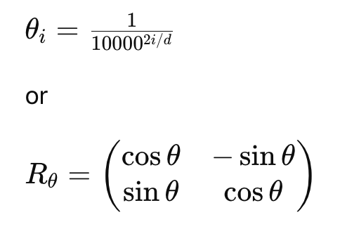  

## Single Q/K Vector versus entire Q/K Matrix  
### Single Token  
Suppose we have one token with d=4:  

After projection:  
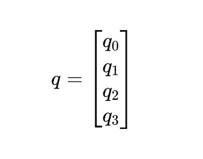  

This is a single query vector.  

RoPE operates on this vector by rotating:
* (q0, q1)  
* (q2, q3)  
independently.  

## Fundamentals of RoPE Geometry  
Suppose vector v = [1,0]. This vector points directly right on x-axis. We want a mathmatical operation that rotates this vector counter-clockwise. 
This is where the concept of Rotation Matrix comes in. The matrix:
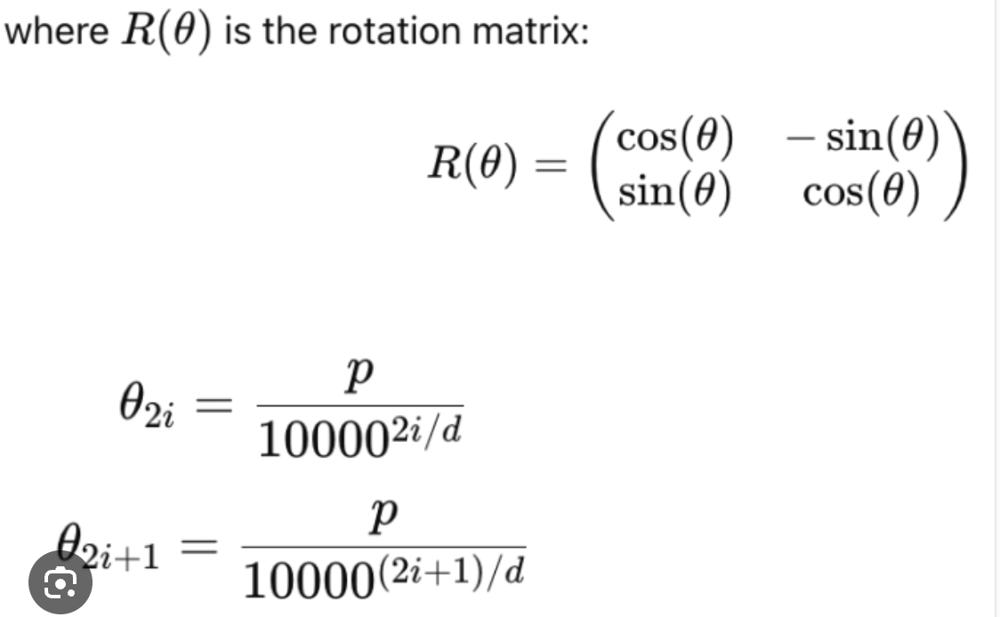  

This is the standard rotation matrix from linear algebra. 

## What is a Matrix Geometrically  
A matrix fundamentally is a geometric transformation. Some matrices:  
* Stretch vectors  
* Shrink vectors  
* Reflect vectors  
* Shear vectors  
* Rotate vectors  (This is what the rotation matrix does)  

## The Deep Intuition  
Suppose v = v = [1,0]. Then R(theta) means: rotate v by angle theta  

## Why cosine and sine appear  
Points on a unit circle are (cos(theta), sin(theta)). Rotation fundamentally involves circular geometry. So sine / cosine naturally emerge.  

$
\begin{pmatrix}
a & b & c \\
c & d & e
\end{pmatrix}
$

### Entire Sequence  
Now suppose sentence:  
`The cat sat down`  
4 tokens, each token being of 4D (4 dimensions)  

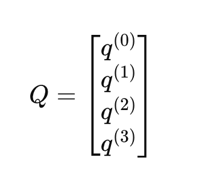  

where each row is a query vector.  

For example:  
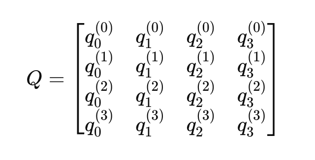  

Shape:  
4x4 (sequence_length * head_dimension)  

### Where Does RoPE Apply  
RoPE does NOT rotate the entire matrix as one object.  

Instead:  
For row 0:  
* rotate using position 0.  
For row 1:  
* rotate using position 1.  
For row 2:  
* rotate using position 2.  
For row 3:  
* rotate using position 3.  

#### Visual Picture  
Before:  
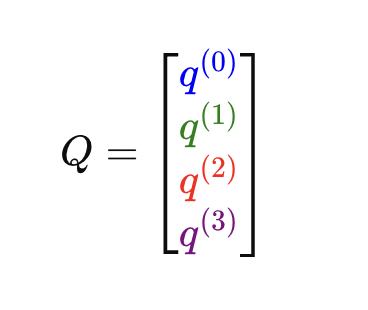  

RoPE applies:  
R0 to first row, R1 to 2nd row, R2 to third row, R3 to fourth row  
where R is the rotation matrix  

#### Real LLM Example  
Suppose:  
* sequence_length = 8192  
* head_dim = 128  

Then:  
Q = 8192 x 128  for one attention head  

RoPE would process 8192 rows  
Within each row, 64 independent 2D rotation, because 128/2 = 64 dimension pairs   

#### Mental Model  
Think of RoPE as:  
for every token position:  
    for every dimension pair:  
        rotate that 2D pair  

#### Then Attention Happens  
Only AFTER RoPE modifies Q and K do we compute: QK^T  
The flow is:  
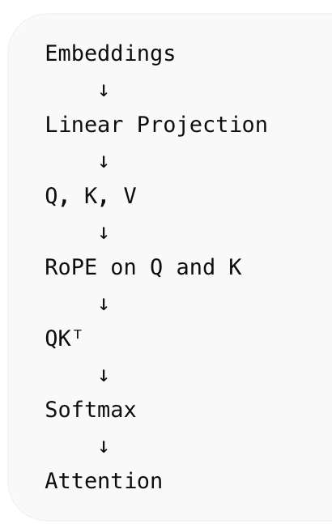  

RoPE is fundamentally a per-token vector transformation.  

Attention is fundamentally a matrix operation across all tokens.  

### Explanation of Attention-style similarity matrix: Q_rope @ Q_rope.T  shown in `q_matrix_rope_lab.py`  
Q_rope @ Q_rope.T means Q_rope matrix_mul Q_rope.T  

Lets use 4-Token Sentence  
`The cat sat down`  

Suppose after RoPE we have:  
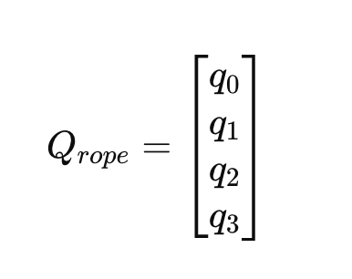  

where: each row is one token's rotated query vector.  

Shape: 4 x d  

#### What is Q_rope.T?  
Transpose means rows become columns.
So Q_rope.T has shape d x 4  

Multiply them gives 4 x 4 shape, because (4×d)(d×4) = 4×4  

Each cell contains 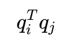, which is dot product between token i and token j  

#### Visual Picture  
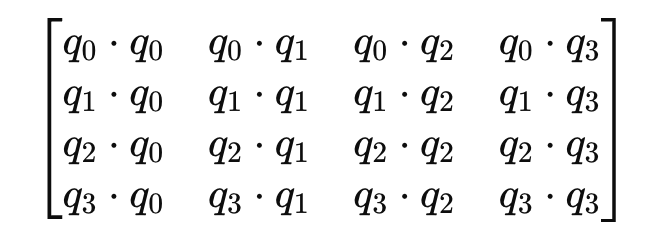  

Every cell is a similarity score.  

Attention is fundamentally asking "How similar is every token to every other token?". This matrix answers that question.  

#### Example  
Suppose "The cat sat down"  

After RoPE:  
Maybe "cat" and "sat" have similar orientations.  
Then 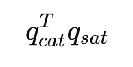 will be high.  

But "The" and "down" might have very different orientations.  
Then 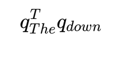 will be low. 

RoPE modifies vector orientations before these dot products are computed.  

RoPE directly changes the entries of: 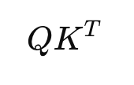  

E.g attention dot product matrix (after RoPE was applied to the vectors)
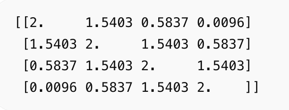  

Interpretation:  
* same token position → 2.0000  
* 1 position apart → 1.5403  
* 2 positions apart → 0.5837  
* 3 positions apart → 0.0096  

So RoPE made similarity decrease as relative distance increased.  

Also notice the diagonals:  
* main diagonal: 2.0000  
* one-off diagonal: 1.5403  
* two-off diagonal: 0.5837  
* three-off diagonal: 0.0096  

This means the score depends on relative offset, not absolute position.  

For example:  
* The ↔ cat = 1.5403  
* cat ↔ sat = 1.5403  
* sat ↔ down = 1.5403  

All are one position apart, so all have the same similarity.  
