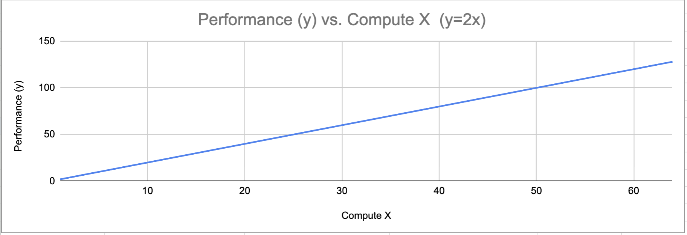
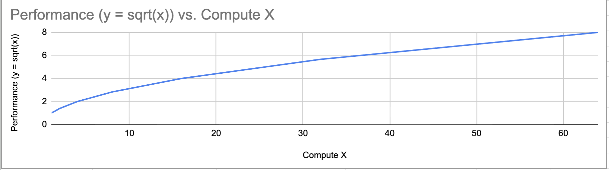
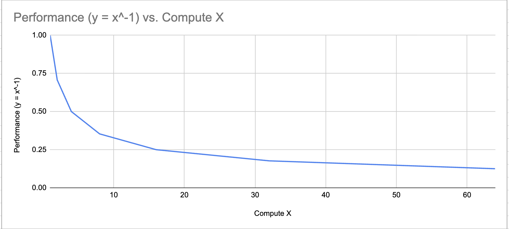
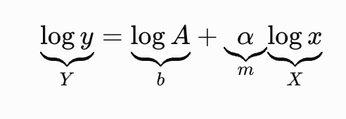
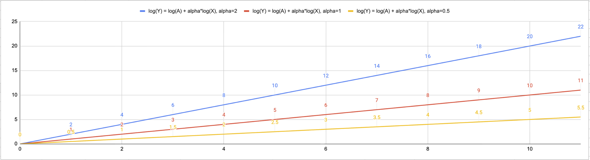
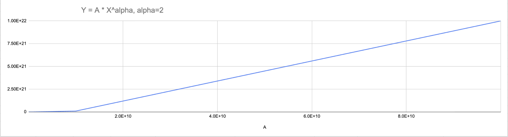
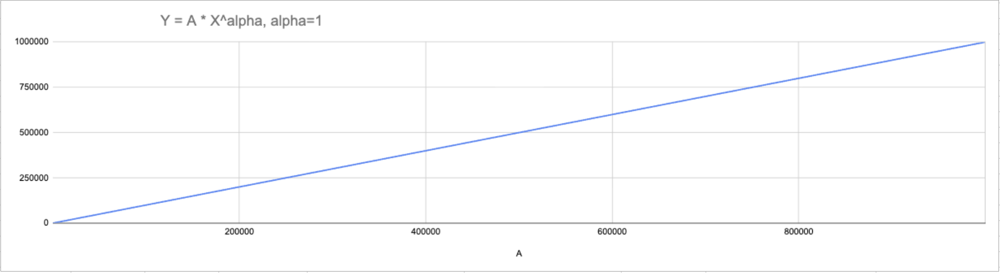
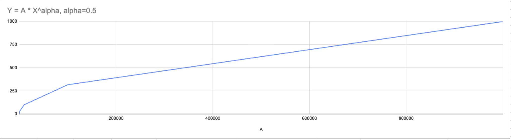

# Scaling Laws understanding from First Principles  
The relationship between a model's scale (e.g. compute, dataset size, and parameter counts) and its performance is described by scaling laws.  

## What are we trying to relate?  
Suppose we train an AI model. We can increase:  
* Parameters N: number of learned weights  
* Dataset size D: number of training tokens / examples  
* Compute C: total training computation  

And we measure some outcome:  
* loss  
* error rate  
* accuracy  
* benchmark store  

A Scaling law asks:  
`If i make the model or training process bigger, how does performance change?`  
For example:  
$$
\text{Loss} = f(\text{Compute})
$$
The entire question is about the shape of f.  

## Start with the simplest possible relationship: linear  
Imagine: `y=2x`  
Then:  
| Compute (x) | Performance (y) |  
| ----------: | --------------: |  
|           1 |               2 |  
|           2 |               4 |  
|           4 |               8 |  
|           8 |              16 |

  
Every time compute doubles, performance doubles. This is constant proportional return. But real neural-network scaling generally does not behave this generously.  

## Introducing diminishing returns  
Suppose:  
$$
y = x^{0.5}
$$
OR  
$$
y = sqrt(x)  
$$
This is a **Power Law** because it has the general form:  
$$
y = A x^{\alpha}
$$
where:  
* A = constant  
* x = scale variable, such as compute  
* alpha = scaling exponent  

Take:  
$$
y = x^{0.5}
$$
  
Sublinear gains but the absolute gains are still increasing:  
`1→1.414 gain = 0.414  `  
`1.414 → 2 gain = 0.586  `  
`2 → 2.828 gain = 0.828  `  
This reveals an important subtlety: saying simply that "each doubling gives a smaller gain" is not automatically true for every power law.  

## LLM scaling laws are often written in terms of loss  
A common conceptual form is:  
$$
L(C) = L_{\infty} + A C^{-\alpha}
$$
where:  
* C = compute  
* L(C) = model loss  
* L_inf = irreducible floor  
* A = scaling constant  
* alpha > 0 = scaling exponent  
Ignoring L_inf temporarily:  
$$
L(C) = C^{-\alpha}
$$
Suppose:  
α=0.1  
Then:  
$$
L(C) = C^{-0.5}
$$ 
  
Compute keeps doubling:  
`1 → 2 → 4 → 8 → 16 → 32`  
But loss improves relatively slowly.  
That is the basic intuition behind diminishing returns: enormous increases in resources are required for continued incremental improvement.  

## Why is this called a power law?  
Because one variable is raised to a power:  
\[
y = A x^\alpha
\]
The exponent alpha controls how aggressively y scales with x.  
Linear scaling of alpha is 1. Sublinear scaling if alpha is > 0 and < 1. Superlinear scaling if alpha > 1.  

## Why does a power law become a straight line on log-log axis?  
Start with:  
\[
y = A x^\alpha
\]  

Take the logarithm of both sides:  
`log y = log(Ax^alpha)`

Using:  
`log(ab) = log a + log b`  

we get:  
`log y = log A + log(x^alpha)`  

Using:
`log(x^alpha) = alpha * log x`  

we get:  
`log(y) = log(A) + alpha * log(x)`  

Now define:  
`Y=log(y)`  
and:  
`X=log(x)`  

Then:  
`Y = log(A) + alpha * X`  

Compare that to the standard equation of a straight line:  
`Y = b + mX`  

They are identical in structure:  
  

Therefore:  
**Power law => straight line on log-log axes**
And the slope of that line is: **alpha**  
This is the mathematical heart of the passage.  

  
versus on ordinary axis:  
  
  
  

## Why log-log plots are especially useful for AI scaling?  
Suppose compute ranges from:  
`10^15 -> 10^26`  

That is an 11-order-of-magnitude range. On an ordinary axis, the smaller values get visually crushed near zero:  
`10^15, 10^16, ..., 10^26`  
But on a log axis, these become:  
`15,16,17,...,26`  
Now each order of magnitude gets equal visual space.  
That makes a log-log plot excellent for seeing whether a relationship remains stable across enormous ranges of:
* compute  
* parameters  
* tokens    
* loss  

On a normal x-axis, the compute values are positioned by absolute distance. So 1, 10, 100, and even 1,000 get crushed near the left edge because the axis must extend all the way to 100,000:
`1  10  100  1000                         100000`  
`|---almost crushed here----------------------|`  
The graph becomes hard to inspect across scales.  

Now make the x-axis logarithmic. Instead of positioning by C, position by:  
`log_10(C)`  
Then:  
`1 → 0,10 → 1,100 → 2,1000 → 3,10000 → 4`  
So every 10x increase in compute gets equal visual space:  
1      10      100      1000      10000  
|-------|--------|--------|----------|  
That explains why logging the x-axis helps: it makes huge compute ranges visible.
Same for y-axis. Because performance also changes multiplicatively under a power law.  

So, on a normal axis, equal distances mean equal additions: +100, +100, +100. But scaling laws concern equal multiplications: x10, x10, ...  
Log axes convert equal multiplications into equal distances.  

**Normal axes visualize additive change**  

**Log axes visualize multiplicative change**  

**And because a power law relates multiplicative changes in compute to multiplicative changes in performance, log-log coordinates are the natural way to expose the pattern.**  

**NOTE: log-log is not mathematically “necessary” to plot the data. We can plot it on normal axes. It is necessary in the practical sense that it makes a stable power-law trend across many orders of magnitude easy to see, compare, and measure.**   

