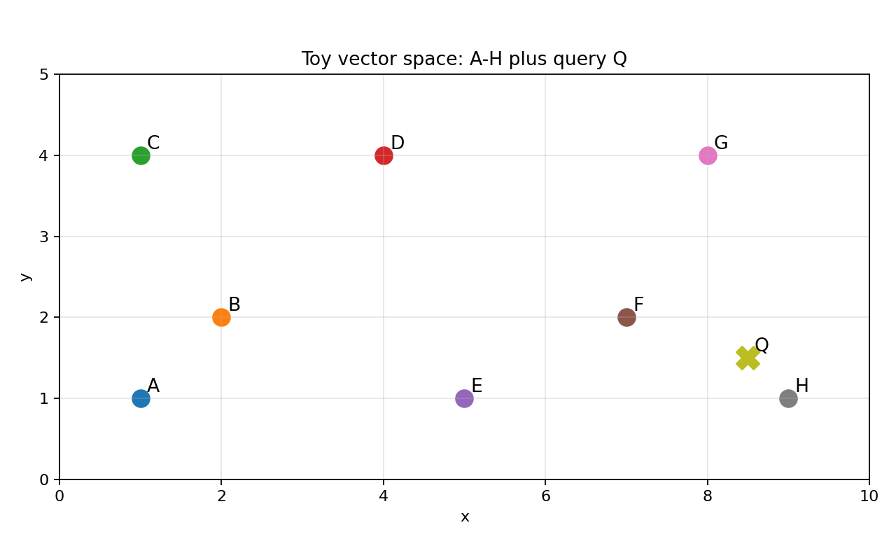
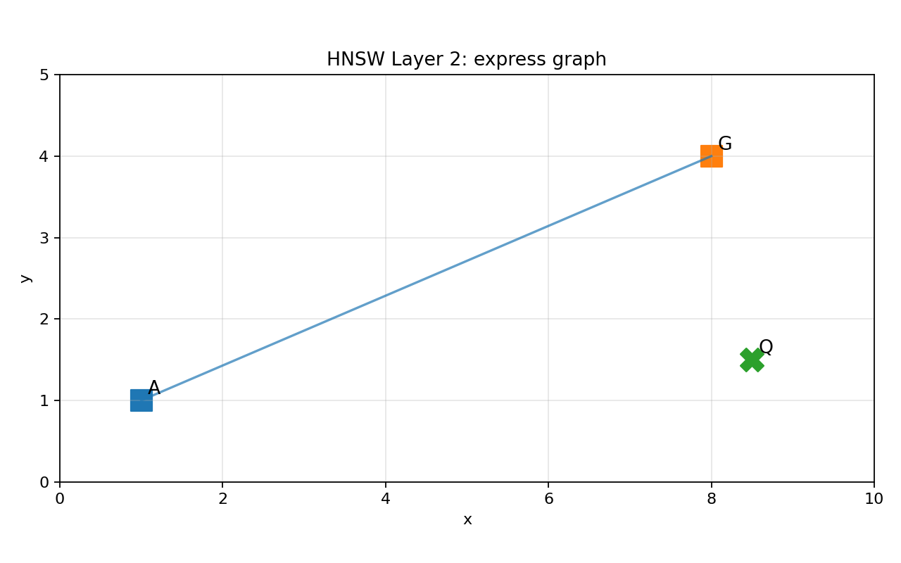
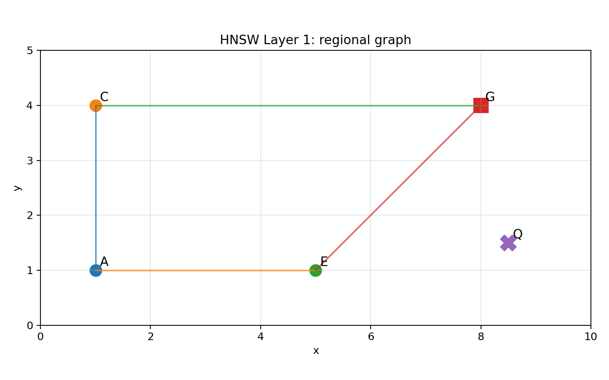
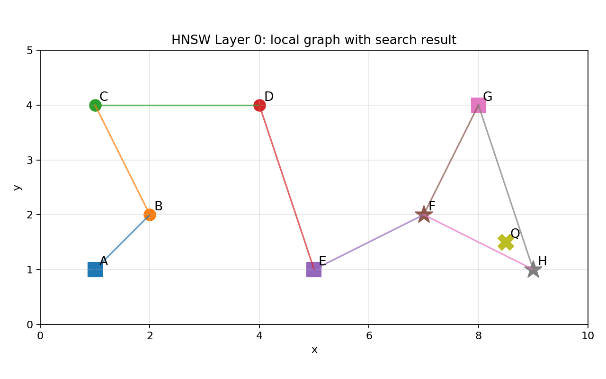

# Indexing Algorithm: Hierarchical Navigable Small World (HNSW)  
## Introduction  
HNSW, is a graph-based algorithm for approximate nearest neighbor search.  
It is commonly used in vector databases to quickly find vectors that are similar to a query vector, such as embeddings for text, images, documents, or user behavior.  

In a **brute-force search**, the query vector is compared against every vector in the dataset. This gives exact results, but it becomes expensive when the dataset contains millions of high-dimensional vectors.  
HNSW speeds this up by building a multi-layer graph index. Each vector is represented as a node, and nearby vectors are connected by edges. The upper layers contain fewer nodes and allow long-distance jumps across the vector space, while the bottom layer contains all vectors and supports fine-grained local search.  

At query time, HNSW starts from an entry point in the top layer and greedily moves toward nodes that are closer to the query. It then descends layer by layer, carrying forward the best node found so far. At the bottom layer, it performs a broader local search to return the top-k nearest neighbors. This allows HNSW to examine only a small fraction of the dataset while still achieving high recall.  

The main tuning parameters are M, which controls how many graph neighbors each node keeps; efConstruction, which controls how carefully the graph is built; and efSearch, which controls how broadly the graph is searched at query time. Increasing these values generally improves recall but also increases memory usage, build time, or query latency.  

In short, HNSW trades exact exhaustive search for a carefully constructed navigable graph, enabling fast and accurate vector similarity search at large scale.  

## Notes on visualizations  
The main learning points are visible in the output:  
`Layer 2: A → G  
 Layer 1: stay near G  
 Layer 0: expand around G, discover F and H  
Return top-2: H, F`  

  




# HNSW Toy Example: Index Construction and Query Search

This note walks through a small, hand-worked HNSW-style example using two-dimensional vectors. It is intentionally simplified so the mechanics are easy to see.

We use:

```text
M = 2
efConstruction = 3
efSearch = 4
k = 2
```

In real HNSW implementations, neighbor selection and pruning use additional heuristics, and Layer 0 often allows more neighbors than upper layers. This toy example uses simplified nearest-neighbor pruning unless otherwise noted.

## Vectors to Insert

| Vector | Coordinates | Maximum layer |
|---|---:|---:|
| A | (1, 1) | 2 |
| B | (2, 2) | 0 |
| C | (1, 4) | 1 |
| D | (4, 4) | 0 |
| E | (5, 1) | 1 |
| F | (7, 2) | 0 |
| G | (8, 4) | 2 |
| H | (9, 1) | 0 |

A vector exists on every layer from Layer 0 through its maximum layer.

For example, if a vector has `max_layer = 2`, it exists on Layers 0, 1, and 2.

---

# Index Construction

## Insert A = (1, 1), max_layer = 2

A is the first vector, so it becomes the entry point.

```text
Layer 2:
  A

Layer 1:
  A

Layer 0:
  A
```

---

## Insert B = (2, 2), max_layer = 0

Start at Layer 2. The layer has only A, so descend to the same node ID at Layer 1. Layer 1 also has only A, so descend to Layer 0.

At Layer 0, connect B to A.

```text
Layer 2:
  A

Layer 1:
  A

Layer 0:
  A --- B
```

---

## Insert C = (1, 4), max_layer = 1

Start at Layer 2. The layer has only A, so descend to Layer 1.

At Layer 1, connect C to A.

```text
Layer 1:
  A --- C
```

Now descend from A on Layer 1 to A on Layer 0.

At Layer 0:

```text
eDist(C, A) = 3.00
eDist(C, B) = 2.24
```

Since `M = 2`, connect C to both A and B.

```text
Layer 2:
  A

Layer 1:
  A --- C

Layer 0:
  A --- B
   \   /
     C
```

---

## Insert D = (4, 4), max_layer = 0

Start at Layer 2. The layer has only A, so descend to Layer 1.

At Layer 1:

```text
eDist(D, A) = 4.24
eDist(D, C) = 3.00
```

C is closer, so move to C and descend to C on Layer 0.

At Layer 0:

```text
eDist(D, A) = 4.24
eDist(D, B) = 2.83
eDist(D, C) = 3.00
```

With `efConstruction = 3`, all three nodes can be held in the candidate set.

With `M = 2`, D initially selects B and C.

Before pruning:

```text
Layer 0:

  A --- B --- D
   \   |    /
    \  |   /
       C
```

B now has three neighbors: A, C, and D. Since `M = 2`, one edge must be pruned.

```text
eDist(B, A) = 1.41
eDist(B, C) = 2.24
eDist(B, D) = 2.83
```

B prunes D.

C also has three neighbors: A, B, and D.

```text
eDist(C, A) = 3.00
eDist(C, B) = 2.24
eDist(C, D) = 3.00
```

There is a tie between A and D. For this toy example, retain D and prune A on Layer 0. The C-A edge still exists on Layer 1.

After pruning:

```text
Layer 2:
  A

Layer 1:
  A --- C

Layer 0:
  A --- B --- C --- D
```

---

## Insert E = (5, 1), max_layer = 1

Start at Layer 2. The layer has only A, so descend to Layer 1.

At Layer 1:

```text
eDist(E, A) = 4.00
eDist(E, C) = 5.00
```

Since `M = 2`, connect E to both A and C.

```text
Layer 1:

  A --- C
   \   /
     E
```

A is closer to E than C is, so the Layer 1 search position remains A. Descend from A on Layer 1 to A on Layer 0.

At Layer 0, before inserting E:

```text
Layer 0:
  A --- B --- C --- D
```

Important point:

`efConstruction = 3` does **not** mean "only consider the first three nodes encountered: A, B, C." It means the algorithm maintains a bounded candidate/result set while exploring the graph. It can still discover D if the search expands through C.

Distances from E:

```text
eDist(E, A) = 4.00
eDist(E, B) = 3.16
eDist(E, C) = 5.00
eDist(E, D) = 3.16
```

With `efConstruction = 3`, the best candidates are approximately:

```text
B: 3.16
D: 3.16
A: 4.00
```

With `M = 2`, E initially selects B and D.

Before pruning:

```text
Layer 0:

  A --- B --- C --- D
        \         /
         \       /
             E
```

B now has three neighbors: A, C, and E.

```text
eDist(B, A) = 1.41
eDist(B, C) = 2.24
eDist(B, E) = 3.16
```

B prunes E. D accepts E.

After pruning:

```text
Layer 2:
  A

Layer 1:
  A --- C
   \   /
     E

Layer 0:
  A --- B --- C --- D --- E
```

---

## Insert F = (7, 2), max_layer = 0

Start at Layer 2. The layer has only A, so descend to Layer 1.

At Layer 1:

```text
eDist(F, A) = 6.08
eDist(F, C) = 6.32
eDist(F, E) = 2.24
```

Move to E and descend to E on Layer 0.

At Layer 0:

```text
eDist(F, E) = 2.24
eDist(F, D) = 3.61
eDist(F, C) = 6.32
```

With `efConstruction = 3`, the best candidates are approximately E, D, and C.

With `M = 2`, F initially selects E and D.

Before pruning:

```text
Layer 0:

  A --- B --- C --- D --- E
                  \   /
                    F
```

D now has three neighbors: C, E, and F.

```text
eDist(D, C) = 3.00
eDist(D, E) = 3.16
eDist(D, F) = 3.61
```

D prunes F. E accepts F.

After pruning:

```text
Layer 2:
  A

Layer 1:
  A --- C
   \   /
     E

Layer 0:
  A --- B --- C --- D --- E --- F
```

---

## Insert G = (8, 4), max_layer = 2

At Layer 2, only A exists. Connect G to A.

```text
Layer 2:
  A --- G
```

Descend from A to A on Layer 1.

At Layer 1:

```text
eDist(G, A) = 7.62
eDist(G, C) = 7.00
eDist(G, E) = 4.24
```

With `efConstruction = 3`, consider A, C, and E. With `M = 2`, G initially selects E and C.

Before pruning:

```text
Layer 1:

      A
    /   \
   C --- E
    \   /
      G
```

E now has three neighbors: A, C, and G.

```text
eDist(E, A) = 4.00
eDist(E, G) = 4.24
eDist(E, C) = 5.00
```

E prunes C. For this toy example, the resulting Layer 1 graph is:

```text
Layer 1:

      A
    /   \
   C     E
    \   /
      G
```

This gives the graph a useful regional path from A/C toward G/E.

Now continue toward Layer 0. Since E is closer to G than C or A, descend from E on Layer 1 to E on Layer 0.

At Layer 0, before inserting G:

```text
Layer 0:
  A --- B --- C --- D --- E --- F
```

Distances from G:

```text
eDist(G, E) = 4.24
eDist(G, F) = 2.24
eDist(G, D) = 4.00
eDist(G, C) = 7.00
```

With `M = 2`, G initially selects F and D.

Before pruning:

```text
Layer 0:

  A --- B --- C --- D --- E --- F
                  \           /
                   \         /
                         G
```

D now has three neighbors: C, E, and G.

```text
eDist(D, C) = 3.00
eDist(D, E) = 3.16
eDist(D, G) = 4.00
```

D prunes G. F accepts G.

After pruning:

```text
Layer 2:
  A --- G

Layer 1:

      A
    /   \
   C     E
    \   /
      G

Layer 0:
  A --- B --- C --- D --- E --- F --- G
```

---

## Insert H = (9, 1), max_layer = 0

At Layer 2:

```text
eDist(H, A) = 8.00
eDist(H, G) = 3.16
```

Move to G and descend to G on Layer 1.

At Layer 1:

```text
eDist(H, G) = 3.16
eDist(H, E) = 4.00
eDist(H, C) = 8.54
```

Neither E nor C is closer than G, so stay at G and descend to G on Layer 0.

At Layer 0:

```text
eDist(H, G) = 3.16
eDist(H, F) = 2.24
eDist(H, E) = 4.00
```

With `M = 2`, H selects G and F.

Before pruning:

```text
Layer 0:

  A --- B --- C --- D --- E --- F --- G
                                \   /
                                  H
```

F now has three neighbors: E, G, and H.

```text
eDist(F, E) = 2.24
eDist(F, G) = 2.24
eDist(F, H) = 2.24
```

All three tie.

If we strictly keep only two neighbors and prune E, the graph becomes disconnected:

```text
Layer 0:

  A --- B --- C --- D --- E     F --- G
                                \   /
                                  H
```

This disconnected graph is an artifact of the simplified toy rules:

- `M = 2` is very small.
- Tie pruning is arbitrary.
- Real HNSW uses better neighbor-selection heuristics.
- Real Layer 0 often allows more neighbors than upper layers.

For the query-search walkthrough, we use a more stable teaching graph that preserves the local bridge through E-F and also connects H to F and G:

```text
Layer 0:

  A --- B --- C --- D --- E --- F --- G
                                \   /
                                  H
```

You can think of this as allowing F to retain three Layer 0 neighbors in this toy example.

---

# Overall Index-Creation Pattern

```text
Insert vector
  -> use upper layers to navigate close to its region
  -> descend by the same node ID
  -> search locally on the target layer
  -> connect to selected neighbors
  -> prune if neighbor lists exceed capacity
```

Key tuning parameters:

```text
M = number of neighbors retained per node
efConstruction = breadth of search during index construction
efSearch = breadth of search during query execution
```

---

# Query Search

Query:

```text
Q = (8.5, 1.5)
```

For the search example, use this stable graph:

```text
Layer 2:
  A --- G

Layer 1:
  A --- E
  |     |
  C --- G

Layer 0:
  A --- B --- C --- D --- E --- F --- G
                                \   /
                                  H
```

## Brute-Force Ground Truth

Distances from Q:

```text
eDist(Q, A) = 7.52
eDist(Q, B) = 6.52
eDist(Q, C) = 7.91
eDist(Q, D) = 5.15
eDist(Q, E) = 3.54
eDist(Q, F) = 1.58
eDist(Q, G) = 2.55
eDist(Q, H) = 0.71
```

Exact top 2:

```text
[H, F]
```

---

## Step 1: Layer 2 Greedy Search

Start at A.

```text
eDist(Q, A) = 7.52
eDist(Q, G) = 2.55
```

G is closer, so move to G and descend to Layer 1.

---

## Step 2: Layer 1 Greedy Search

At Layer 1, start from G.

```text
eDist(Q, G) = 2.55
eDist(Q, E) = 3.54
eDist(Q, C) = 7.91
```

Neither E nor C is closer than G, so stay at G and descend to Layer 0.

---

## Step 3: Layer 0 Expanded Search

At Layer 0, start from G.

```text
efSearch = 4
k = 2
```

Start with G:

```text
eDist(Q, G) = 2.55
```

Explore G's neighbors, F and H:

```text
eDist(Q, F) = 1.58
eDist(Q, H) = 0.71
```

Now the best discovered candidates are:

```text
H: 0.71
F: 1.58
G: 2.55
```

Expand H. H's neighbors are F and G, which are already known.

Expand F. F's neighbors include E, G, and H.

```text
eDist(Q, E) = 3.54
```

Now the candidate/result set contains approximately:

```text
H: 0.71
F: 1.58
G: 2.55
E: 3.54
```

Return top `k = 2`:

```text
[H, F]
```

This matches the brute-force top-2 result.

At production scale, the same idea becomes:

```text
HNSW checks hundreds of nodes instead of millions.
```

The upper layers get the search close to the right region. Layer 0 performs the fine-grained local search.
